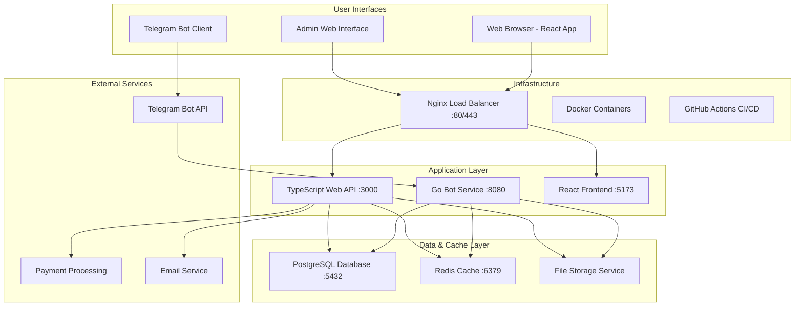

# MeetsMatch - Product Requirements Document (PRD)

## 1. Product Overview

MeetsMatch is a Telegram bot platform designed to facilitate meaningful connections through intelligent matching algorithms and seamless communication tools. The platform combines the accessibility of Telegram with sophisticated web-based management features to create authentic social connections.

- **Core Purpose**: Connect users through intelligent matching for meaningful meetups, networking, and relationships via Telegram bot interface with web application support
- **Target Users**: Individuals aged 18+ seeking social connections, professional networking opportunities, and romantic relationships through a privacy-focused platform
- **Market Value**: Addresses the growing demand for authentic social connections in digital-first environments while leveraging Telegram's widespread adoption and privacy features

## 2. Core Features

### 2.1 User Roles

| Role | Registration Method | Core Permissions |
|------|---------------------|------------------|
| Regular User | Telegram bot registration via `/start` command | Profile management, match browsing, messaging, basic preferences |
| Premium User | In-app subscription upgrade | Advanced filters, unlimited daily matches, priority matching, read receipts |
| Admin | System invitation with admin privileges | User management, content moderation, analytics access, system configuration |

### 2.2 Feature Modules

Our platform consists of the following essential components:

1. **Telegram Bot Interface**: User onboarding, profile setup, match notifications, quick interactions
2. **Web Dashboard**: Advanced profile management, detailed match browsing, analytics overview
3. **Intelligent Matching Engine**: Algorithm-based compatibility scoring, preference-driven suggestions
4. **Communication System**: Secure in-platform messaging, media sharing, conversation management
5. **Admin Panel**: User moderation, content review, system analytics, configuration management

### 2.3 Page Details

| Component | Module Name | Feature Description |
|-----------|-------------|--------------------||
| Telegram Bot | User Registration | Collect profile information (name, age, bio, location), photo upload, preference setup |
| Telegram Bot | Match Discovery | Receive daily match suggestions, quick accept/decline actions, compatibility scores |
| Telegram Bot | Messaging System | Text and media messaging, conversation management, match notifications |
| Web Dashboard | Profile Management | Detailed profile editing, multiple photo uploads, advanced preference configuration |
| Web Dashboard | Match Browser | Browse potential matches with filters, view detailed profiles, advanced search |
| Web Dashboard | Analytics Overview | Personal matching statistics, conversation insights, profile performance metrics |
| Admin Panel | User Management | User account moderation, profile review, account status management |
| Admin Panel | Content Moderation | Report handling, inappropriate content review, safety enforcement tools |
| Admin Panel | System Analytics | Platform usage metrics, matching success rates, user engagement statistics |

## 3. Core Process

### Regular User Flow
1. User discovers bot through Telegram search or referral link
2. Initiates conversation with `/start` command
3. Completes guided profile setup (name, age, bio, photos, location, preferences)
4. Receives daily match suggestions based on compatibility algorithm
5. Reviews matches and makes accept/decline decisions
6. Engages in conversations with mutual matches
7. Optionally accesses web dashboard for advanced features
8. Provides feedback and ratings to improve matching quality

### Premium User Flow
1. Follows regular user flow for initial setup
2. Upgrades to premium subscription through bot interface
3. Accesses advanced filtering options and unlimited daily matches
4. Receives priority placement in other users' match queues
5. Utilizes enhanced messaging features (read receipts, message reactions)
6. Accesses detailed analytics and insights through web dashboard

### Admin Flow
1. Accesses admin panel through secure web interface
2. Monitors user reports and flagged content
3. Reviews and moderates user profiles and conversations
4. Manages system settings and matching algorithm parameters
5. Generates platform analytics and performance reports
6. Handles user support requests and account issues

```mermaid
graph TD
    A[Telegram Bot Discovery] --> B[/start Command]
    B --> C[Profile Setup Wizard]
    C --> D[Photo Upload]
    D --> E[Preference Configuration]
    E --> F[Daily Match Suggestions]
    F --> G{Match Decision}
    G -->|Accept| H[Mutual Match Check]
    G -->|Decline| F
    H -->|Mutual| I[Conversation Started]
    H -->|Not Mutual| F
    I --> J[Messaging Interface]
    J --> K[Web Dashboard Access]
    K --> L[Advanced Features]
    
    M[Admin Login] --> N[Content Moderation]
    M --> O[User Management]
    M --> P[System Analytics]
    N --> Q[Report Resolution]
    O --> R[Account Actions]
    P --> S[Performance Insights]
```

## 4. User Interface Design

### 4.1 Design Style

- **Primary Colors**: #6366F1 (Indigo Blue), #EC4899 (Pink Accent)
- **Secondary Colors**: #F3F4F6 (Light Gray), #1F2937 (Dark Gray), #10B981 (Success Green)
- **Button Style**: Rounded corners (8px radius), gradient backgrounds, smooth hover transitions, shadow effects
- **Typography**: Inter font family, 16px base size, clear hierarchy with 14px/18px/24px variants
- **Layout Style**: Card-based design with clean spacing, mobile-first responsive approach, consistent 16px padding
- **Icons**: Heroicons for consistency, heart/chat/location/star themed icons, 20px standard size

### 4.2 Page Design Overview

| Component | Module Name | UI Elements |
|-----------|-------------|-------------|
| Telegram Bot | Chat Interface | Inline keyboards with rounded buttons, rich media cards, quick reply options, emoji reactions |
| Telegram Bot | Profile Setup | Step-by-step wizard with progress indicators, image upload prompts, slider controls for preferences |
| Web Dashboard | Main Dashboard | Navigation sidebar with icons, match cards in grid layout, floating action buttons, status indicators |
| Web Dashboard | Profile Editor | Tabbed sections, drag-drop photo upload, toggle switches, range sliders, color-coded validation |
| Web Dashboard | Match Browser | Filter sidebar, infinite scroll cards, overlay details, swipe gestures (mobile), bookmark actions |
| Admin Panel | Management Console | Data tables with sorting, status badges, action dropdowns, chart visualizations, search filters |

### 4.3 Responsiveness

The platform is designed mobile-first with responsive breakpoints at 768px (tablet) and 1024px (desktop). Touch interactions are optimized for mobile users with swipe gestures for match browsing, tap-friendly button sizes (minimum 44px), and thumb-friendly navigation. The Telegram bot interface adapts to various screen sizes while maintaining consistent functionality.

## 5. Technical Architecture Overview

### 5.1 Current Implementation Status

**✅ Implemented Components:**
- Go Telegram bot service with Gin framework (70% complete)
- PostgreSQL database with comprehensive schema (100% complete)
- Docker containerization setup (90% complete)
- CI/CD pipeline with GitHub Actions (90% complete)
- User service with CRUD operations (80% complete)

**⚠️ Partially Implemented:**
- Bot command handlers and user flows (30% complete)
- Authentication and session management (40% complete)
- Basic API endpoints structure (50% complete)

**❌ Not Implemented:**
- TypeScript Web API source code (0% complete)
- React frontend application (0% complete)
- Matching algorithm implementation (0% complete)
- Message processing and media handling (0% complete)
- Redis caching integration (0% complete)

### 5.2 System Architecture



### 5.3 Technology Stack

**Backend Services:**
- **Go Bot Service**: Go 1.25.0 + Gin framework + go-telegram/bot library
- **Web API**: TypeScript + Node.js + Express + PostgreSQL client (planned)
- **Database**: PostgreSQL 16+ with JSONB support for flexible data
- **Cache**: Redis 7+ for sessions, real-time data, and performance optimization

**Frontend & Tools:**
- **Web Application**: React 19+ + TypeScript + Vite + Tailwind CSS (planned)
- **Package Management**: Bun 1.2.20 for TypeScript services
- **Containerization**: Docker + Docker Compose for consistent deployment
- **CI/CD**: GitHub Actions with multi-service pipeline and automated testing

### 5.4 Key Architectural Decisions

- **Microservices Architecture**: Separate Go service for Telegram bot, TypeScript service for web API, enabling independent scaling and development
- **Database Strategy**: PostgreSQL for relational data with JSONB for flexible user preferences and analytics, Redis for caching and real-time features
- **API-First Design**: RESTful APIs enabling future mobile app development and third-party integrations
- **Security Focus**: JWT-based authentication, encrypted data storage, comprehensive input validation and sanitization
- **Scalability Preparation**: Containerized services, load balancing ready, database indexing optimized for growth

## 6. Implementation Roadmap

### Phase 1: Core Bot Functionality (4-6 weeks) - HIGH PRIORITY
**Objective**: Complete essential Telegram bot features for MVP launch

- ✅ Complete Go bot service implementation
- ✅ Implement core Telegram command handlers (`/start`, `/profile`, `/help`, `/settings`)
- ✅ Add user registration and profile management flows
- ✅ Implement basic matching algorithm with compatibility scoring
- ✅ Add message handling and basic media upload support
- ✅ Create user preference management system
- ✅ Implement match notification system

### Phase 2: Web API Development (3-4 weeks) - MEDIUM PRIORITY
**Objective**: Enable web-based features and admin capabilities

- ⚠️ Create TypeScript API source structure and basic endpoints
- ⚠️ Implement JWT authentication and session management
- ⚠️ Add user management and profile APIs
- ⚠️ Create matching and messaging APIs
- ⚠️ Integrate Redis caching for performance
- ⚠️ Implement admin APIs for user and content management

### Phase 3: Frontend Development (4-5 weeks) - MEDIUM PRIORITY
**Objective**: Provide advanced web interface for users and admins

- ❌ Build React application structure with routing
- ❌ Implement user authentication and dashboard
- ❌ Create advanced profile management interface
- ❌ Build match browsing and filtering system
- ❌ Add messaging interface with real-time updates
- ❌ Develop comprehensive admin panel
- ❌ Implement responsive design and mobile optimization

### Phase 4: Advanced Features & Launch (3-4 weeks) - LOW PRIORITY
**Objective**: Polish features and prepare for production launch

- ❌ Implement premium subscription system
- ❌ Add advanced matching filters and preferences
- ❌ Create analytics and reporting dashboard
- ❌ Implement comprehensive testing and quality assurance
- ❌ Set up production deployment and monitoring
- ❌ Create user documentation and support materials

## 7. Success Metrics & KPIs

### User Engagement Metrics
- **Daily Active Users (DAU)**: Target 1,000+ within 3 months of launch
- **User Retention**: 70% 7-day retention, 40% 30-day retention
- **Profile Completion Rate**: 85% of users complete full profile setup
- **Match Interaction Rate**: 60% of suggested matches receive user interaction

### Platform Performance Metrics
- **Match Success Rate**: 25% of mutual matches lead to ongoing conversations
- **Response Time**: <2 seconds for bot responses, <500ms for web API
- **System Uptime**: 99.5% availability target
- **User Satisfaction**: 4.2+ average rating from user feedback

### Business Metrics
- **Premium Conversion Rate**: 15% of active users upgrade to premium
- **Customer Acquisition Cost (CAC)**: <$10 per user through organic growth
- **Monthly Recurring Revenue (MRR)**: $5,000+ within 6 months
- **User Support Ticket Volume**: <5% of active users require support monthly

## 8. Risk Assessment & Mitigation

### Technical Risks
- **Implementation Gaps**: Large portions of planned features not yet implemented
  - *Mitigation*: Focus on MVP features first, iterative development approach
- **Technology Stack Complexity**: Multiple services requiring coordination
  - *Mitigation*: Comprehensive testing, staged deployment, monitoring systems
- **Scalability Challenges**: Potential performance issues with user growth
  - *Mitigation*: Database optimization, caching strategy, load testing

### Business Risks
- **User Adoption**: Competition from established dating and social platforms
  - *Mitigation*: Unique Telegram integration, privacy focus, community building
- **Content Moderation**: Managing inappropriate content and user safety
  - *Mitigation*: Automated filtering, human moderation, clear community guidelines
- **Regulatory Compliance**: Data privacy and protection requirements
  - *Mitigation*: GDPR compliance, data encryption, transparent privacy policies

## 9. Quality Assurance & Testing Strategy

### Testing Requirements
- **Unit Testing**: 80% minimum code coverage across all services
- **Integration Testing**: API endpoint testing, database interaction validation
- **End-to-End Testing**: Complete user journey testing from registration to messaging
- **Performance Testing**: Load testing for concurrent users, response time validation
- **Security Testing**: Authentication testing, input validation, data protection

### Quality Gates
- All critical features must pass automated testing before deployment
- Manual testing required for user interface changes
- Security review mandatory for authentication and data handling features
- Performance benchmarks must be met before production release

## 10. Launch Strategy

### Pre-Launch Phase (2 weeks)
- Complete core bot functionality and basic web features
- Conduct comprehensive testing with beta user group (50-100 users)
- Finalize content moderation policies and safety features
- Prepare user documentation and onboarding materials

### Soft Launch Phase (4 weeks)
- Limited release to 500 initial users through invitation system
- Monitor system performance and user feedback
- Iterate on features based on real user behavior
- Refine matching algorithm based on success metrics

### Public Launch Phase (Ongoing)
- Open registration with organic growth strategy
- Implement referral system to encourage user acquisition
- Launch premium features and subscription system
- Scale infrastructure based on user growth patterns

This PRD provides a comprehensive roadmap for developing and launching MeetsMatch as a successful Telegram-based social connection platform with modern web capabilities.