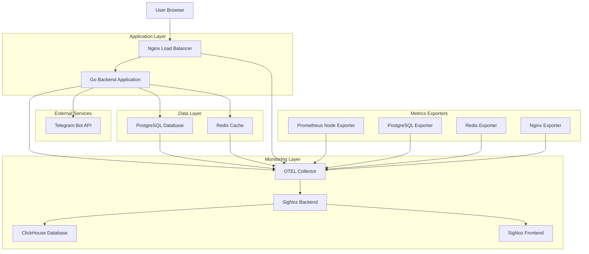
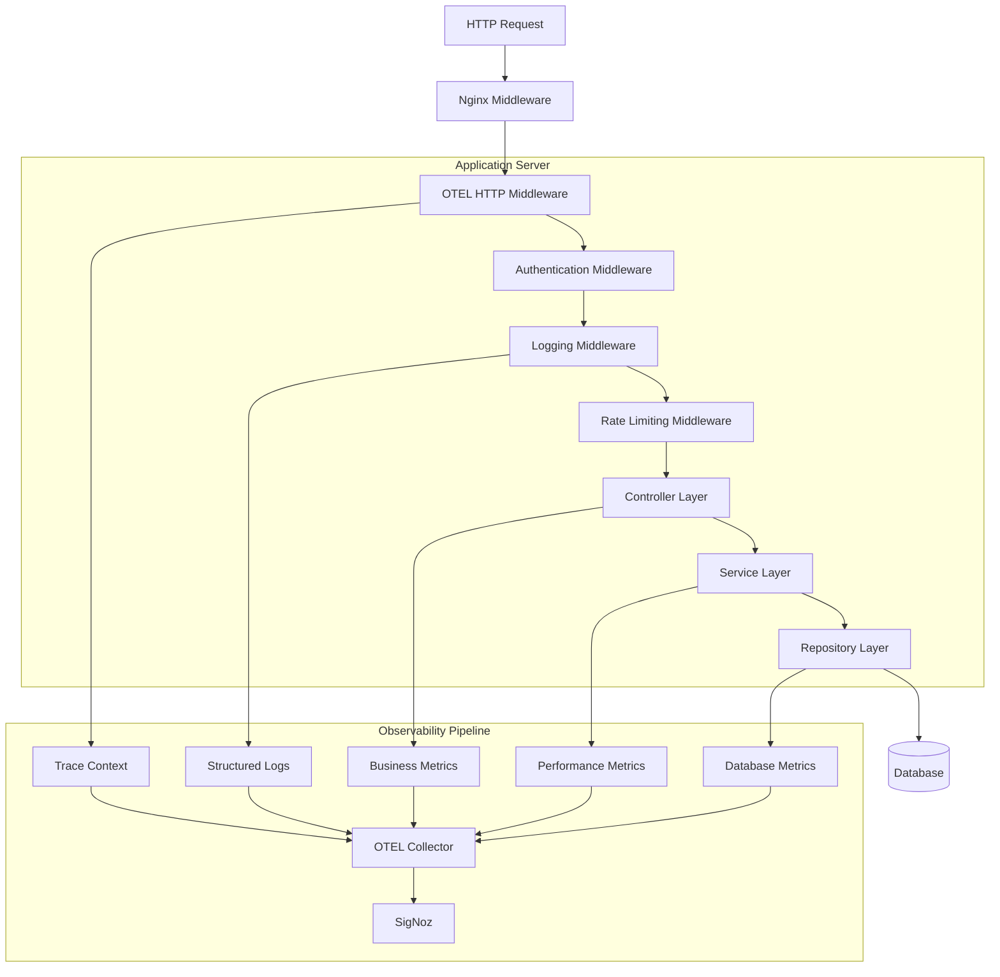
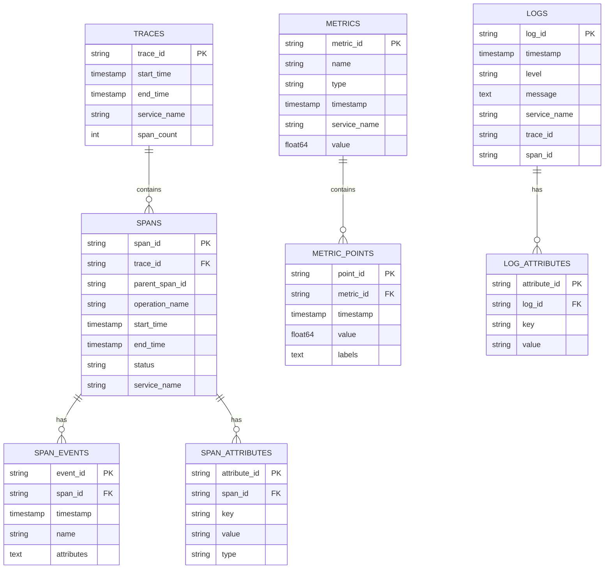

# MeetsMatch Monitoring Technical Architecture

## 1. Architecture Design



## 2. Technology Description

- **Frontend**: React@18 + TypeScript + Vite
- **Backend**: Go@1.21 + Gin + GORM
- **Database**: PostgreSQL@15 + Redis@7
- **Monitoring**: SigNoz@0.45 + OpenTelemetry@1.21
- **Infrastructure**: Docker + Docker Compose + Nginx
- **Observability Stack**:
  - OpenTelemetry Go SDK@1.21.0
  - OpenTelemetry Collector@0.89.0
  - SigNoz@0.45.0
  - ClickHouse@23.8 (for SigNoz storage)
  - Prometheus exporters for infrastructure metrics

## 3. Route Definitions

| Route | Purpose | Monitoring |
|-------|---------|------------|
| /api/health | Health check endpoint | Basic availability monitoring |
| /api/auth/* | Authentication endpoints | Auth success/failure rates |
| /api/users/* | User management | User operation metrics |
| /api/matches/* | Matching functionality | Match success rates, latency |
| /api/telegram/* | Telegram bot webhooks | Message processing metrics |
| /metrics | Prometheus metrics endpoint | Application metrics exposure |
| /debug/pprof/* | Go profiling endpoints | Performance debugging |

## 4. API Definitions

### 4.1 Core Monitoring APIs

**Health Check**
```
GET /api/health
```

Response:
| Param Name | Param Type | Description |
|------------|------------|-------------|
| status | string | Overall health status (healthy/unhealthy) |
| timestamp | string | ISO 8601 timestamp |
| services | object | Individual service health status |
| version | string | Application version |

Example:
```json
{
  "status": "healthy",
  "timestamp": "2024-01-15T10:30:00Z",
  "services": {
    "database": "healthy",
    "redis": "healthy",
    "telegram": "healthy"
  },
  "version": "1.0.0"
}
```

**Metrics Endpoint**
```
GET /metrics
```

Response: Prometheus format metrics
```
# HELP http_requests_total Total number of HTTP requests
# TYPE http_requests_total counter
http_requests_total{method="GET",status="200"} 1234

# HELP http_request_duration_seconds HTTP request duration
# TYPE http_request_duration_seconds histogram
http_request_duration_seconds_bucket{le="0.1"} 100
http_request_duration_seconds_bucket{le="0.5"} 200
```

### 4.2 Tracing Context Propagation

**Trace Headers**
| Header Name | Description | Example |
|-------------|-------------|----------|
| traceparent | W3C trace context | 00-4bf92f3577b34da6a3ce929d0e0e4736-00f067aa0ba902b7-01 |
| tracestate | Vendor-specific trace state | signoz=sampling_rate:1.0 |
| baggage | Cross-cutting concerns | user_id=123,session_id=abc |

## 5. Server Architecture Diagram



## 6. Data Model

### 6.1 Monitoring Data Model



### 6.2 Application Metrics Schema

```sql
-- Custom metrics tables for application-specific data
CREATE TABLE user_activity_metrics (
    id UUID PRIMARY KEY DEFAULT gen_random_uuid(),
    user_id UUID NOT NULL,
    action_type VARCHAR(50) NOT NULL,
    timestamp TIMESTAMP WITH TIME ZONE DEFAULT NOW(),
    duration_ms INTEGER,
    success BOOLEAN DEFAULT true,
    metadata JSONB,
    trace_id VARCHAR(32),
    span_id VARCHAR(16)
);

CREATE INDEX idx_user_activity_timestamp ON user_activity_metrics(timestamp DESC);
CREATE INDEX idx_user_activity_trace ON user_activity_metrics(trace_id);
CREATE INDEX idx_user_activity_user ON user_activity_metrics(user_id);

CREATE TABLE match_performance_metrics (
    id UUID PRIMARY KEY DEFAULT gen_random_uuid(),
    user_id UUID NOT NULL,
    algorithm_version VARCHAR(20) NOT NULL,
    processing_time_ms INTEGER NOT NULL,
    matches_found INTEGER NOT NULL,
    timestamp TIMESTAMP WITH TIME ZONE DEFAULT NOW(),
    trace_id VARCHAR(32),
    span_id VARCHAR(16)
);

CREATE INDEX idx_match_performance_timestamp ON match_performance_metrics(timestamp DESC);
CREATE INDEX idx_match_performance_algorithm ON match_performance_metrics(algorithm_version);

CREATE TABLE telegram_bot_metrics (
    id UUID PRIMARY KEY DEFAULT gen_random_uuid(),
    user_id UUID,
    message_type VARCHAR(50) NOT NULL,
    processing_time_ms INTEGER NOT NULL,
    success BOOLEAN DEFAULT true,
    error_message TEXT,
    timestamp TIMESTAMP WITH TIME ZONE DEFAULT NOW(),
    trace_id VARCHAR(32)
);

CREATE INDEX idx_telegram_metrics_timestamp ON telegram_bot_metrics(timestamp DESC);
CREATE INDEX idx_telegram_metrics_type ON telegram_bot_metrics(message_type);
```

## 7. OpenTelemetry Configuration

### 7.1 Go Application Configuration

```go
// internal/monitoring/otel.go
package monitoring

import (
    "context"
    "time"
    
    "go.opentelemetry.io/otel"
    "go.opentelemetry.io/otel/exporters/otlp/otlptrace/otlptracehttp"
    "go.opentelemetry.io/otel/exporters/otlp/otlpmetric/otlpmetrichttp"
    "go.opentelemetry.io/otel/propagation"
    "go.opentelemetry.io/otel/sdk/metric"
    "go.opentelemetry.io/otel/sdk/resource"
    "go.opentelemetry.io/otel/sdk/trace"
    semconv "go.opentelemetry.io/otel/semconv/v1.21.0"
)

type OTelConfig struct {
    ServiceName     string
    ServiceVersion  string
    Environment     string
    CollectorURL    string
    SamplingRate    float64
}

func InitializeOTel(config OTelConfig) (func(), error) {
    ctx := context.Background()
    
    // Create resource
    res, err := resource.New(ctx,
        resource.WithAttributes(
            semconv.ServiceName(config.ServiceName),
            semconv.ServiceVersion(config.ServiceVersion),
            semconv.DeploymentEnvironment(config.Environment),
        ),
    )
    if err != nil {
        return nil, err
    }
    
    // Initialize tracing
    traceExporter, err := otlptracehttp.New(ctx,
        otlptracehttp.WithEndpoint(config.CollectorURL),
        otlptracehttp.WithInsecure(),
    )
    if err != nil {
        return nil, err
    }
    
    tracerProvider := trace.NewTracerProvider(
        trace.WithBatcher(traceExporter),
        trace.WithResource(res),
        trace.WithSampler(trace.TraceIDRatioBased(config.SamplingRate)),
    )
    
    otel.SetTracerProvider(tracerProvider)
    
    // Initialize metrics
    metricExporter, err := otlpmetrichttp.New(ctx,
        otlpmetrichttp.WithEndpoint(config.CollectorURL),
        otlpmetrichttp.WithInsecure(),
    )
    if err != nil {
        return nil, err
    }
    
    meterProvider := metric.NewMeterProvider(
        metric.WithReader(metric.NewPeriodicReader(metricExporter,
            metric.WithInterval(30*time.Second))),
        metric.WithResource(res),
    )
    
    otel.SetMeterProvider(meterProvider)
    
    // Set global propagator
    otel.SetTextMapPropagator(propagation.NewCompositeTextMapPropagator(
        propagation.TraceContext{},
        propagation.Baggage{},
    ))
    
    return func() {
        tracerProvider.Shutdown(ctx)
        meterProvider.Shutdown(ctx)
    }, nil
}
```

### 7.2 Middleware Integration

```go
// internal/middleware/otel.go
package middleware

import (
    "github.com/gin-gonic/gin"
    "go.opentelemetry.io/contrib/instrumentation/github.com/gin-gonic/gin/otelgin"
    "go.opentelemetry.io/otel"
    "go.opentelemetry.io/otel/attribute"
    "go.opentelemetry.io/otel/metric"
)

type OTelMiddleware struct {
    requestCounter   metric.Int64Counter
    requestDuration  metric.Float64Histogram
    activeRequests   metric.Int64UpDownCounter
}

func NewOTelMiddleware() (*OTelMiddleware, error) {
    meter := otel.Meter("meetsmatch-http")
    
    requestCounter, err := meter.Int64Counter(
        "http_requests_total",
        metric.WithDescription("Total number of HTTP requests"),
    )
    if err != nil {
        return nil, err
    }
    
    requestDuration, err := meter.Float64Histogram(
        "http_request_duration_seconds",
        metric.WithDescription("HTTP request duration in seconds"),
        metric.WithUnit("s"),
    )
    if err != nil {
        return nil, err
    }
    
    activeRequests, err := meter.Int64UpDownCounter(
        "http_requests_active",
        metric.WithDescription("Number of active HTTP requests"),
    )
    if err != nil {
        return nil, err
    }
    
    return &OTelMiddleware{
        requestCounter:  requestCounter,
        requestDuration: requestDuration,
        activeRequests:  activeRequests,
    }, nil
}

func (m *OTelMiddleware) Handler() gin.HandlerFunc {
    return gin.HandlerFunc(func(c *gin.Context) {
        // Use otelgin for automatic tracing
        otelgin.Middleware("meetsmatch-api")(c)
        
        // Custom metrics
        start := time.Now()
        m.activeRequests.Add(c.Request.Context(), 1)
        
        c.Next()
        
        duration := time.Since(start).Seconds()
        status := c.Writer.Status()
        
        attrs := []attribute.KeyValue{
            attribute.String("method", c.Request.Method),
            attribute.String("route", c.FullPath()),
            attribute.Int("status", status),
        }
        
        m.requestCounter.Add(c.Request.Context(), 1, metric.WithAttributes(attrs...))
        m.requestDuration.Record(c.Request.Context(), duration, metric.WithAttributes(attrs...))
        m.activeRequests.Add(c.Request.Context(), -1)
    })
}
```

## 8. Database Instrumentation

### 8.1 PostgreSQL Monitoring

```go
// internal/database/instrumentation.go
package database

import (
    "context"
    "database/sql"
    "time"
    
    "go.opentelemetry.io/otel"
    "go.opentelemetry.io/otel/attribute"
    "go.opentelemetry.io/otel/metric"
    "go.opentelemetry.io/otel/trace"
    "gorm.io/gorm"
)

type DBInstrumentation struct {
    queryDuration    metric.Float64Histogram
    queryCounter     metric.Int64Counter
    connectionPool   metric.Int64UpDownCounter
    tracer          trace.Tracer
}

func NewDBInstrumentation() (*DBInstrumentation, error) {
    meter := otel.Meter("meetsmatch-database")
    tracer := otel.Tracer("meetsmatch-database")
    
    queryDuration, err := meter.Float64Histogram(
        "db_query_duration_seconds",
        metric.WithDescription("Database query duration in seconds"),
        metric.WithUnit("s"),
    )
    if err != nil {
        return nil, err
    }
    
    queryCounter, err := meter.Int64Counter(
        "db_queries_total",
        metric.WithDescription("Total number of database queries"),
    )
    if err != nil {
        return nil, err
    }
    
    connectionPool, err := meter.Int64UpDownCounter(
        "db_connections_active",
        metric.WithDescription("Number of active database connections"),
    )
    if err != nil {
        return nil, err
    }
    
    return &DBInstrumentation{
        queryDuration:  queryDuration,
        queryCounter:   queryCounter,
        connectionPool: connectionPool,
        tracer:        tracer,
    }, nil
}

func (d *DBInstrumentation) GormPlugin() gorm.Plugin {
    return &gormPlugin{instrumentation: d}
}

type gormPlugin struct {
    instrumentation *DBInstrumentation
}

func (p *gormPlugin) Name() string {
    return "otel-instrumentation"
}

func (p *gormPlugin) Initialize(db *gorm.DB) error {
    // Register callbacks for query instrumentation
    db.Callback().Query().Before("gorm:query").Register("otel:before_query", p.beforeQuery)
    db.Callback().Query().After("gorm:query").Register("otel:after_query", p.afterQuery)
    
    db.Callback().Create().Before("gorm:create").Register("otel:before_create", p.beforeQuery)
    db.Callback().Create().After("gorm:create").Register("otel:after_create", p.afterQuery)
    
    db.Callback().Update().Before("gorm:update").Register("otel:before_update", p.beforeQuery)
    db.Callback().Update().After("gorm:update").Register("otel:after_update", p.afterQuery)
    
    db.Callback().Delete().Before("gorm:delete").Register("otel:before_delete", p.beforeQuery)
    db.Callback().Delete().After("gorm:delete").Register("otel:after_delete", p.afterQuery)
    
    return nil
}

func (p *gormPlugin) beforeQuery(db *gorm.DB) {
    ctx, span := p.instrumentation.tracer.Start(db.Statement.Context, "db.query")
    db.Statement.Context = ctx
    
    span.SetAttributes(
        attribute.String("db.system", "postgresql"),
        attribute.String("db.operation", db.Statement.SQL.String()),
        attribute.String("db.table", db.Statement.Table),
    )
    
    db.Set("otel:start_time", time.Now())
    db.Set("otel:span", span)
}

func (p *gormPlugin) afterQuery(db *gorm.DB) {
    startTime, _ := db.Get("otel:start_time")
    span, _ := db.Get("otel:span")
    
    if start, ok := startTime.(time.Time); ok {
        duration := time.Since(start).Seconds()
        
        attrs := []attribute.KeyValue{
            attribute.String("operation", db.Statement.SQL.String()),
            attribute.String("table", db.Statement.Table),
        }
        
        if db.Error != nil {
            attrs = append(attrs, attribute.Bool("error", true))
            if s, ok := span.(trace.Span); ok {
                s.RecordError(db.Error)
            }
        }
        
        p.instrumentation.queryDuration.Record(db.Statement.Context, duration, metric.WithAttributes(attrs...))
        p.instrumentation.queryCounter.Add(db.Statement.Context, 1, metric.WithAttributes(attrs...))
    }
    
    if s, ok := span.(trace.Span); ok {
        s.End()
    }
}
```

### 8.2 Redis Instrumentation

```go
// internal/cache/instrumentation.go
package cache

import (
    "context"
    "time"
    
    "github.com/redis/go-redis/v9"
    "go.opentelemetry.io/otel"
    "go.opentelemetry.io/otel/attribute"
    "go.opentelemetry.io/otel/metric"
    "go.opentelemetry.io/otel/trace"
)

type RedisInstrumentation struct {
    commandDuration metric.Float64Histogram
    commandCounter  metric.Int64Counter
    cacheHits      metric.Int64Counter
    cacheMisses    metric.Int64Counter
    tracer         trace.Tracer
}

func NewRedisInstrumentation() (*RedisInstrumentation, error) {
    meter := otel.Meter("meetsmatch-redis")
    tracer := otel.Tracer("meetsmatch-redis")
    
    commandDuration, err := meter.Float64Histogram(
        "redis_command_duration_seconds",
        metric.WithDescription("Redis command duration in seconds"),
        metric.WithUnit("s"),
    )
    if err != nil {
        return nil, err
    }
    
    commandCounter, err := meter.Int64Counter(
        "redis_commands_total",
        metric.WithDescription("Total number of Redis commands"),
    )
    if err != nil {
        return nil, err
    }
    
    cacheHits, err := meter.Int64Counter(
        "redis_cache_hits_total",
        metric.WithDescription("Total number of cache hits"),
    )
    if err != nil {
        return nil, err
    }
    
    cacheMisses, err := meter.Int64Counter(
        "redis_cache_misses_total",
        metric.WithDescription("Total number of cache misses"),
    )
    if err != nil {
        return nil, err
    }
    
    return &RedisInstrumentation{
        commandDuration: commandDuration,
        commandCounter:  commandCounter,
        cacheHits:      cacheHits,
        cacheMisses:    cacheMisses,
        tracer:         tracer,
    }, nil
}

func (r *RedisInstrumentation) Hook() redis.Hook {
    return &redisHook{instrumentation: r}
}

type redisHook struct {
    instrumentation *RedisInstrumentation
}

func (h *redisHook) DialHook(next redis.DialHook) redis.DialHook {
    return next
}

func (h *redisHook) ProcessHook(next redis.ProcessHook) redis.ProcessHook {
    return func(ctx context.Context, cmd redis.Cmder) error {
        start := time.Now()
        
        ctx, span := h.instrumentation.tracer.Start(ctx, "redis.command")
        defer span.End()
        
        span.SetAttributes(
            attribute.String("db.system", "redis"),
            attribute.String("db.operation", cmd.Name()),
        )
        
        err := next(ctx, cmd)
        
        duration := time.Since(start).Seconds()
        
        attrs := []attribute.KeyValue{
            attribute.String("command", cmd.Name()),
        }
        
        if err != nil {
            attrs = append(attrs, attribute.Bool("error", true))
            span.RecordError(err)
            
            if err == redis.Nil {
                h.instrumentation.cacheMisses.Add(ctx, 1)
            }
        } else {
            if cmd.Name() == "get" || cmd.Name() == "mget" {
                h.instrumentation.cacheHits.Add(ctx, 1)
            }
        }
        
        h.instrumentation.commandDuration.Record(ctx, duration, metric.WithAttributes(attrs...))
        h.instrumentation.commandCounter.Add(ctx, 1, metric.WithAttributes(attrs...))
        
        return err
    }
}

func (h *redisHook) ProcessPipelineHook(next redis.ProcessPipelineHook) redis.ProcessPipelineHook {
    return func(ctx context.Context, cmds []redis.Cmder) error {
        start := time.Now()
        
        ctx, span := h.instrumentation.tracer.Start(ctx, "redis.pipeline")
        defer span.End()
        
        span.SetAttributes(
            attribute.String("db.system", "redis"),
            attribute.String("db.operation", "pipeline"),
            attribute.Int("db.pipeline.commands", len(cmds)),
        )
        
        err := next(ctx, cmds)
        
        duration := time.Since(start).Seconds()
        
        attrs := []attribute.KeyValue{
            attribute.String("command", "pipeline"),
            attribute.Int("commands_count", len(cmds)),
        }
        
        if err != nil {
            attrs = append(attrs, attribute.Bool("error", true))
            span.RecordError(err)
        }
        
        h.instrumentation.commandDuration.Record(ctx, duration, metric.WithAttributes(attrs...))
        h.instrumentation.commandCounter.Add(ctx, int64(len(cmds)), metric.WithAttributes(attrs...))
        
        return err
    }
}
```

This technical architecture document provides the detailed implementation framework for integrating comprehensive monitoring with SigNoz and OpenTelemetry across the MeetsMatch application stack, ensuring full observability and performance tracking.