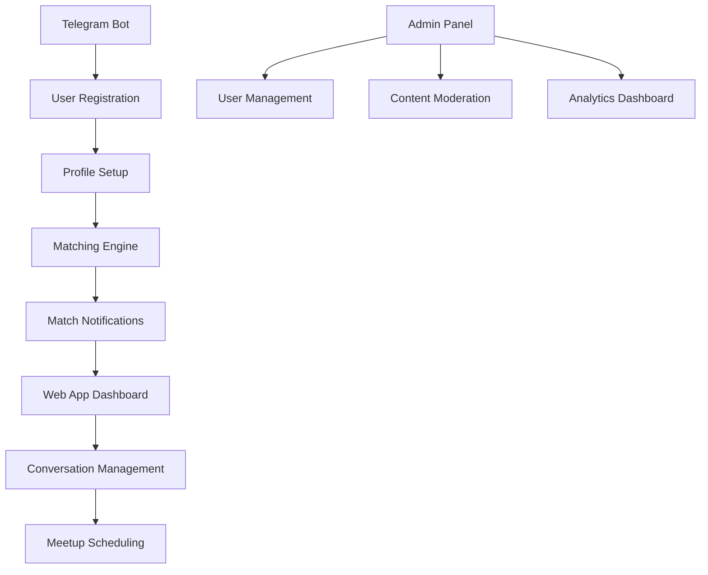
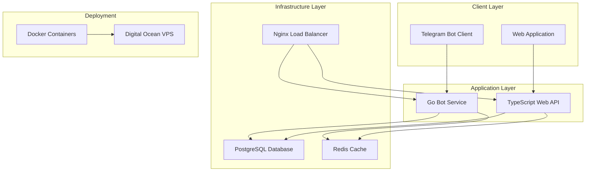

# MeetsMatch - Project Overview & Architecture

## 1. Product Overview
MeetsMatch is a Telegram bot designed to facilitate meaningful connections between users through intelligent matching algorithms. The platform includes both a Telegram bot interface and a web application, enabling users to find and schedule meetups based on shared interests, location, and preferences.

- **Core Purpose**: Connect users through intelligent matching for meaningful meetups and relationships
- **Target Users**: Individuals seeking social connections, networking opportunities, and romantic relationships
- **Market Value**: Addresses the growing need for authentic social connections in digital-first environments

## 2. Core Features

### 2.1 User Roles
| Role | Registration Method | Core Permissions |
|------|---------------------|------------------|
| Regular User | Telegram registration | Profile management, matching, messaging |
| Premium User | Subscription upgrade | Advanced filters, unlimited matches, priority support |
| Admin | System invitation | User management, content moderation, analytics access |

### 2.2 Feature Modules
Our platform consists of the following main components:
1. **Telegram Bot Interface**: User onboarding, profile management, match notifications, basic interactions
2. **Web Application**: Advanced profile editing, detailed match browsing, analytics dashboard
3. **Matching Engine**: Algorithm-based user matching, preference processing, compatibility scoring
4. **Communication System**: In-app messaging, media sharing, conversation management
5. **Admin Dashboard**: User management, content moderation, system analytics

### 2.3 Page Details
| Component | Module Name | Feature Description |
|-----------|-------------|--------------------|
| Telegram Bot | User Registration | Collect basic profile info, preferences setup, location sharing |
| Telegram Bot | Match Notifications | Real-time match alerts, quick accept/decline actions |
| Telegram Bot | Basic Messaging | Text messaging, media sharing, conversation management |
| Web App | Profile Management | Detailed profile editing, photo uploads, preference configuration |
| Web App | Match Browser | Browse potential matches, advanced filtering, detailed profiles |
| Web App | Analytics Dashboard | User engagement metrics, match success rates, usage statistics |
| Admin Panel | User Management | User moderation, account management, support tools |
| Admin Panel | Content Moderation | Report handling, content review, safety enforcement |

## 3. Core Process

### Regular User Flow
1. User starts bot via `/start` command in Telegram
2. Complete profile setup (name, age, interests, location)
3. Receive match suggestions based on preferences
4. Accept/decline matches through bot or web interface
5. Engage in conversations with matched users
6. Schedule meetups and provide feedback

### Admin Flow
1. Access admin dashboard through web interface
2. Monitor user activity and reported content
3. Review and moderate flagged profiles/conversations
4. Manage system settings and matching algorithms
5. Generate analytics reports and insights

## 4. User Interface Design

### 4.1 Design Style
- **Primary Colors**: #6366F1 (Indigo), #EC4899 (Pink)
- **Secondary Colors**: #F3F4F6 (Light Gray), #1F2937 (Dark Gray)
- **Button Style**: Rounded corners (8px), gradient backgrounds, hover animations
- **Typography**: Inter font family, 16px base size, clear hierarchy
- **Layout Style**: Card-based design, clean spacing, mobile-first approach
- **Icons**: Heroicons for consistency, heart/chat/location themed icons

### 4.2 Interface Overview

| Component | Module | UI Elements |
|-----------|--------|-------------|
| Telegram Bot | Chat Interface | Inline keyboards, quick reply buttons, rich media cards |
| Web App | Dashboard | Navigation sidebar, match cards grid, floating action buttons |
| Web App | Profile Editor | Form sections, image upload areas, toggle switches |
| Admin Panel | Management Console | Data tables, status indicators, action buttons, charts |

### 4.3 Responsiveness
The web application is mobile-first with responsive breakpoints at 768px (tablet) and 1024px (desktop). Touch interactions are optimized for mobile users, with swipe gestures for match browsing and tap-friendly button sizes.

## 5. Technical Architecture Overview

### 5.1 System Components

### 5.2 Technology Stack
- **Backend**: Go (Telegram bot service), Node.js/TypeScript (Web API)
- **Frontend**: React with TypeScript, Tailwind CSS
- **Database**: PostgreSQL (primary data), Redis (caching/sessions)
- **Infrastructure**: Docker containers, Nginx reverse proxy
- **Deployment**: Digital Ocean VPS, Docker Compose orchestration

### 5.3 Key Architectural Decisions
- **Microservices**: Separate Go service for Telegram bot, TypeScript service for web API
- **Database Strategy**: PostgreSQL for relational data, Redis for caching and real-time features
- **Containerization**: All services containerized for consistent deployment and scaling
- **Load Balancing**: Nginx for request routing and SSL termination
- **Monitoring**: Built-in health checks and logging for all services