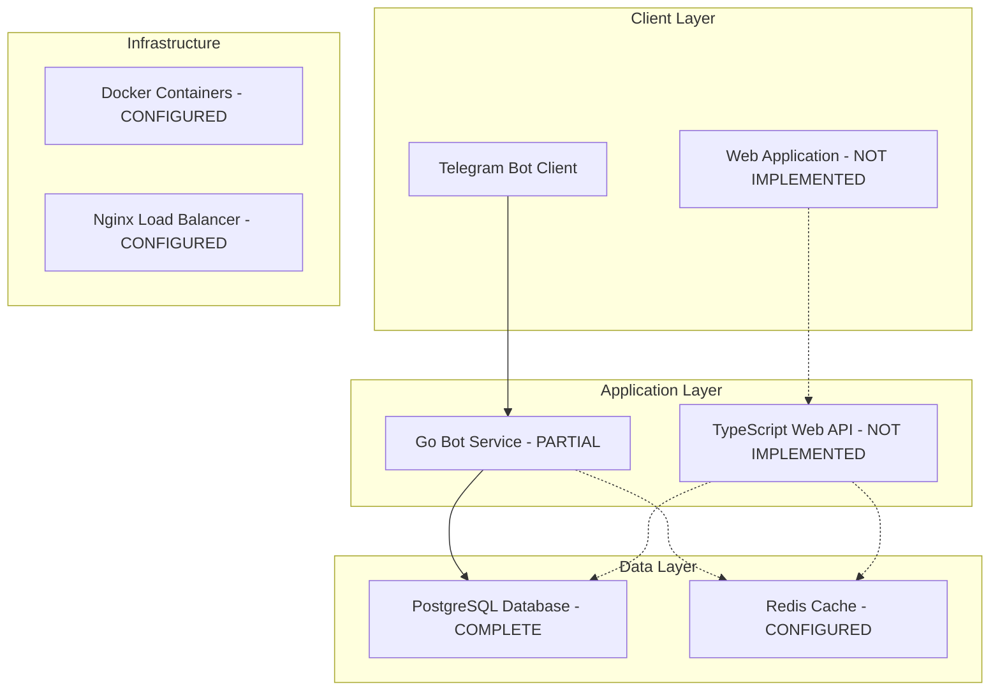

# MeetsMatch - Project Status Report & Overview

## 1. Executive Summary

**Project Status**: Early Development Phase (30% Complete)

MeetsMatch is a Telegram bot platform designed to facilitate meaningful connections through intelligent matching algorithms. The project has undergone a significant technology stack migration from the originally planned Rust/Cloudflare Workers architecture to a more traditional but robust Go/TypeScript microservices architecture.

### Critical Status Update
- **Backend Core**: Go Telegram bot service partially implemented
- **Database Layer**: Fully implemented with PostgreSQL schema
- **Web API**: Configuration complete, implementation pending
- **Frontend**: Configuration complete, no source code implemented
- **Documentation**: Major inaccuracies corrected in this update

## 2. Current Technology Stack

### Implemented Components
- **Go Bot Service**: Go 1.25.0 with Gin framework
- **Database**: PostgreSQL 16+ with comprehensive schema
- **Package Management**: Bun 1.2.20 (replacing npm/yarn)
- **CI/CD**: GitHub Actions with multi-service pipeline
- **Containerization**: Docker configuration ready

### Configured But Not Implemented
- **Web API**: TypeScript/Node.js with Express framework
- **Frontend**: React 19+ with TypeScript and Tailwind CSS
- **Infrastructure**: Nginx load balancer, Redis caching

## 3. Implementation Status Assessment

### ✅ Completed Components

#### Go Telegram Bot Service (70% Complete)
- **Main Application**: `/cmd/bot/main.go` - Full server setup with webhook/polling support
- **User Service**: Complete CRUD operations for user management
- **Database Models**: Comprehensive data structures for users, matches, messages
- **Database Schema**: Full PostgreSQL schema with proper indexing and triggers
- **Bot Handler**: Basic structure implemented in `/internal/bothandler/`
- **Middleware**: Authentication, logging, and rate limiting foundations

#### Database Architecture (100% Complete)
- **Schema**: Complete with users, matches, messages, conversations, analytics tables
- **Migrations**: Initial schema migration fully implemented
- **Indexes**: Optimized for performance with proper foreign key relationships
- **JSON Support**: JSONB fields for photos, preferences, and analytics data

#### CI/CD Pipeline (90% Complete)
- **Multi-Service Build**: Separate jobs for Go, TypeScript API, and React frontend
- **Quality Gates**: Go vet, fmt, staticcheck, and comprehensive testing
- **Package Management**: Bun integration for TypeScript components
- **Code Coverage**: Codecov integration for all services

### ⚠️ Partially Implemented

#### Go Bot Service - Missing Components
- **Bot Commands**: Core Telegram command handlers not implemented
- **Matching Algorithm**: Service structure exists but logic not implemented
- **Message Processing**: Basic structure without actual message handling
- **File Upload**: Media handling for user photos not implemented

### ❌ Not Implemented

#### TypeScript Web API (0% Complete)
- **Source Code**: Only configuration files exist, no `/src` directory
- **API Routes**: Route structure defined but no implementation
- **Authentication**: JWT and session management not implemented
- **Database Integration**: PostgreSQL connection not established

#### React Frontend (0% Complete)
- **Source Code**: No `/src` directory or components
- **UI Components**: No React components implemented
- **State Management**: Zustand store not configured
- **API Integration**: No connection to backend services

## 4. Critical Issues Identified

### Documentation Inconsistencies (RESOLVED)
- ❌ **README.md**: Described Rust/Cloudflare Workers (incorrect)
- ❌ **Makefile**: Referenced Rust commands (cargo, wasm-pack)
- ❌ **Build Scripts**: Configured for Rust instead of Go
- ❌ **Architecture Docs**: Described non-existent Rust implementation

### Build System Misalignment
- **Makefile**: Still references Rust commands despite Go implementation
- **Scripts**: Build and test scripts are for Rust, not Go
- **Package Management**: Project uses Bun but some docs reference npm

### Missing Implementation
- **Frontend Source**: Complete React application needs to be built
- **API Implementation**: TypeScript API service needs full implementation
- **Bot Logic**: Core Telegram bot functionality incomplete

## 5. Corrected Architecture Overview

## 6. Implementation Roadmap

### Phase 1: Core Bot Functionality (4-6 weeks)
**Priority: HIGH**
- Complete Telegram bot command handlers
- Implement user registration and profile management
- Add basic matching algorithm
- Implement message handling and media upload

### Phase 2: Web API Development (3-4 weeks)
**Priority: MEDIUM**
- Create TypeScript API source structure
- Implement authentication and user management endpoints
- Add matching and messaging APIs
- Integrate with PostgreSQL database

### Phase 3: Frontend Development (4-5 weeks)
**Priority: MEDIUM**
- Build React application structure
- Implement user dashboard and profile management
- Create match browsing and messaging interfaces
- Add admin panel for user management

### Phase 4: Integration & Deployment (2-3 weeks)
**Priority: LOW**
- Complete Docker containerization
- Set up production deployment pipeline
- Implement monitoring and logging
- Performance optimization and testing

## 7. Immediate Action Items

### Critical Fixes Required
1. **Update Makefile**: Replace Rust commands with Go equivalents
2. **Fix Build Scripts**: Update for Go/TypeScript/React stack
3. **Update README.md**: Correct technology stack description
4. **Create API Source**: Initialize TypeScript API implementation
5. **Create Frontend Source**: Initialize React application structure

### Development Priorities
1. Complete Go bot service core functionality
2. Implement basic Telegram command handlers
3. Add user registration and profile management
4. Create minimal viable matching system

## 8. Test Coverage Assessment

### Current Coverage
- **Go Service**: Basic test structure exists, coverage unknown
- **TypeScript API**: No tests (no source code)
- **Frontend**: No tests (no source code)

### Coverage Goals
- **Target**: 80% minimum across all services
- **Blocker**: Cannot assess until core features are implemented
- **Recommendation**: Implement core functionality first, then focus on test coverage

## 9. Risk Assessment

### High Risk
- **Documentation Debt**: Major inaccuracies corrected but build system still misaligned
- **Implementation Gap**: Large portions of planned features not implemented
- **Technology Mismatch**: Build tools don't match actual technology stack

### Medium Risk
- **Timeline Uncertainty**: Significant work remaining with unclear estimates
- **Integration Complexity**: Multiple services need coordination

### Low Risk
- **Database Design**: Solid foundation with comprehensive schema
- **CI/CD Pipeline**: Well-structured for multi-service development

## 10. Recommendations

### Immediate (This Week)
1. Fix build system and documentation inconsistencies
2. Focus on Go bot service completion
3. Establish clear development priorities

### Short Term (Next Month)
1. Complete core Telegram bot functionality
2. Begin TypeScript API implementation
3. Establish proper testing framework

### Long Term (Next Quarter)
1. Complete full-stack implementation
2. Deploy to production environment
3. Implement comprehensive monitoring and analytics

This assessment provides a realistic view of the current project state and a clear path forward for successful completion.