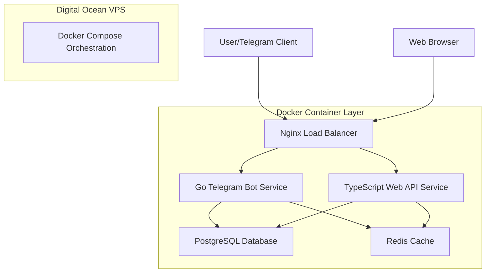
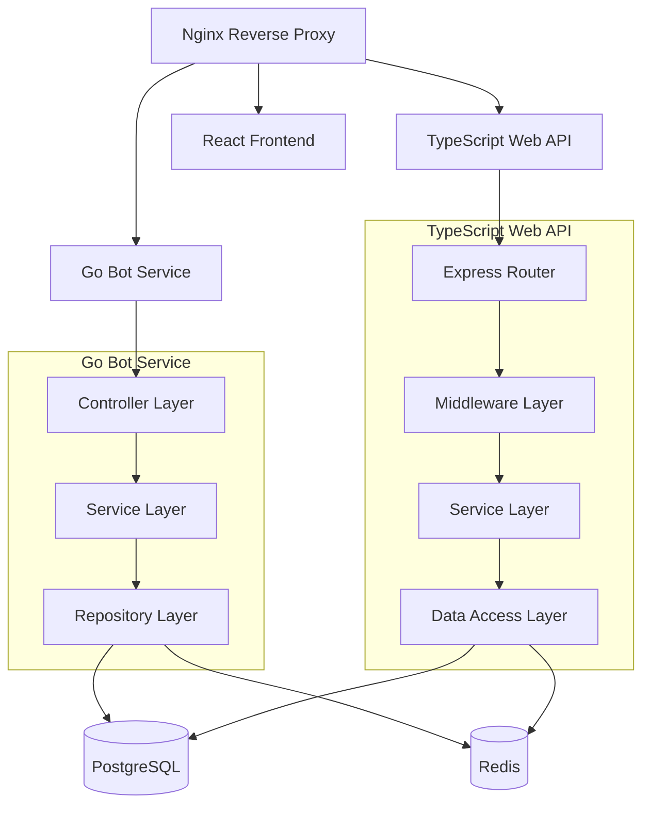
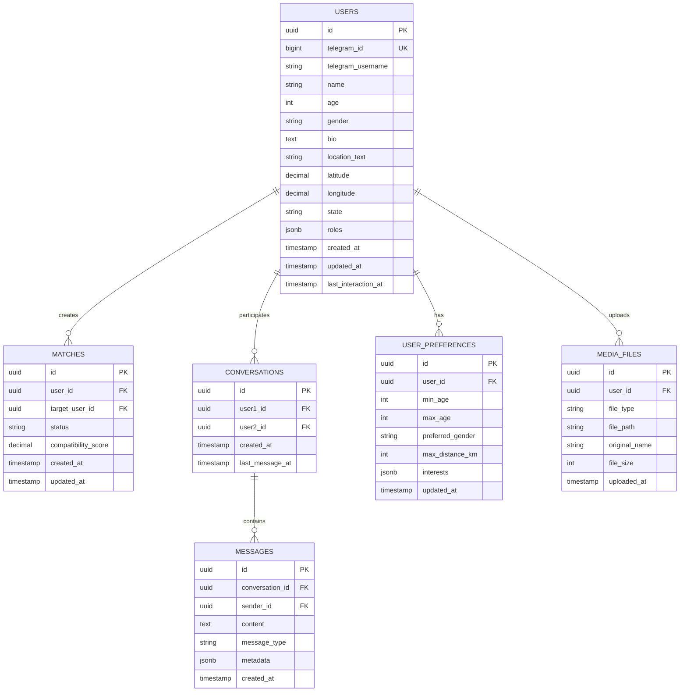

# MeetsMatch - Technical Architecture Document

## 1. Architecture Design



## 2. Technology Description

- **Backend Services**: Go@1.21+ (Telegram bot), Node.js@20+ with TypeScript@5+ (Web API)
- **Frontend**: React@18+ with TypeScript@5+, Vite@5+ build tool
- **Database**: PostgreSQL@16+ (primary), Redis@7+ (cache/sessions)
- **Infrastructure**: Docker@24+, Docker Compose@2.20+, Nginx@1.25+
- **Deployment**: Digital Ocean VPS (Ubuntu 22.04 LTS)

## 3. Route Definitions

### 3.1 Telegram Bot Service (Go)
| Route | Purpose |
|-------|----------|
| `/webhook` | Telegram webhook endpoint for receiving updates |
| `/health` | Health check endpoint for monitoring |
| `/metrics` | Prometheus metrics endpoint |

### 3.2 Web API Service (TypeScript)
| Route | Purpose |
|-------|----------|
| `/api/auth/*` | User authentication and session management |
| `/api/users/*` | User profile management endpoints |
| `/api/matches/*` | Matching system endpoints |
| `/api/conversations/*` | Messaging and conversation endpoints |
| `/api/admin/*` | Administrative functions |
| `/health` | Health check endpoint |
| `/metrics` | Application metrics |

### 3.3 Frontend Routes (React)
| Route | Purpose |
|-------|----------|
| `/` | Landing page and user authentication |
| `/dashboard` | Main user dashboard with matches |
| `/profile` | User profile management |
| `/conversations` | Message center and chat interface |
| `/admin` | Administrative dashboard |

## 4. API Definitions

### 4.1 Authentication API

**User Login**
```
POST /api/auth/login
```

Request:
| Param Name | Param Type | isRequired | Description |
|------------|------------|------------|-------------|
| telegram_id | string | true | Telegram user ID |
| auth_token | string | true | Telegram authentication token |

Response:
| Param Name | Param Type | Description |
|------------|------------|-------------|
| success | boolean | Authentication status |
| user_id | string | User UUID |
| session_token | string | JWT session token |

Example:
```json
{
  "telegram_id": "123456789",
  "auth_token": "telegram_auth_token_here"
}
```

**Get User Profile**
```
GET /api/users/{user_id}
```

Response:
| Param Name | Param Type | Description |
|------------|------------|-------------|
| id | string | User UUID |
| name | string | User display name |
| age | number | User age |
| bio | string | User biography |
| location | object | User location data |
| preferences | object | Matching preferences |

### 4.2 Matching API

**Get Potential Matches**
```
GET /api/matches/potential
```

Query Parameters:
| Param Name | Param Type | isRequired | Description |
|------------|------------|------------|-------------|
| limit | number | false | Number of matches to return (default: 10) |
| offset | number | false | Pagination offset |

Response:
| Param Name | Param Type | Description |
|------------|------------|-------------|
| matches | array | Array of potential match objects |
| total_count | number | Total available matches |
| has_more | boolean | Whether more matches are available |

## 5. Server Architecture Diagram



## 6. Data Model

### 6.1 Database Schema



### 6.2 Data Definition Language

**Users Table**
```sql
-- Create users table
CREATE TABLE users (
    id UUID PRIMARY KEY DEFAULT gen_random_uuid(),
    telegram_id BIGINT UNIQUE NOT NULL,
    telegram_username VARCHAR(255),
    name VARCHAR(100) NOT NULL,
    age INTEGER CHECK (age >= 18 AND age <= 100),
    gender VARCHAR(20) CHECK (gender IN ('male', 'female', 'non-binary', 'other')),
    bio TEXT,
    location_text VARCHAR(255),
    latitude DECIMAL(10, 8),
    longitude DECIMAL(11, 8),
    state VARCHAR(20) DEFAULT 'new' CHECK (state IN ('new', 'onboarding', 'active', 'blocked')),
    roles JSONB DEFAULT '["user"]',
    created_at TIMESTAMP WITH TIME ZONE DEFAULT NOW(),
    updated_at TIMESTAMP WITH TIME ZONE DEFAULT NOW(),
    last_interaction_at TIMESTAMP WITH TIME ZONE DEFAULT NOW()
);

-- Create indexes
CREATE INDEX idx_users_telegram_id ON users(telegram_id);
CREATE INDEX idx_users_state ON users(state);
CREATE INDEX idx_users_location ON users(latitude, longitude) WHERE latitude IS NOT NULL AND longitude IS NOT NULL;
CREATE INDEX idx_users_age_gender ON users(age, gender);
```

**Matches Table**
```sql
-- Create matches table
CREATE TABLE matches (
    id UUID PRIMARY KEY DEFAULT gen_random_uuid(),
    user_id UUID NOT NULL REFERENCES users(id) ON DELETE CASCADE,
    target_user_id UUID NOT NULL REFERENCES users(id) ON DELETE CASCADE,
    status VARCHAR(20) DEFAULT 'pending' CHECK (status IN ('pending', 'accepted', 'declined', 'expired')),
    compatibility_score DECIMAL(3, 2) CHECK (compatibility_score >= 0 AND compatibility_score <= 1),
    created_at TIMESTAMP WITH TIME ZONE DEFAULT NOW(),
    updated_at TIMESTAMP WITH TIME ZONE DEFAULT NOW(),
    UNIQUE(user_id, target_user_id)
);

-- Create indexes
CREATE INDEX idx_matches_user_id ON matches(user_id);
CREATE INDEX idx_matches_target_user_id ON matches(target_user_id);
CREATE INDEX idx_matches_status ON matches(status);
CREATE INDEX idx_matches_score ON matches(compatibility_score DESC);
```

**Conversations Table**
```sql
-- Create conversations table
CREATE TABLE conversations (
    id UUID PRIMARY KEY DEFAULT gen_random_uuid(),
    user1_id UUID NOT NULL REFERENCES users(id) ON DELETE CASCADE,
    user2_id UUID NOT NULL REFERENCES users(id) ON DELETE CASCADE,
    created_at TIMESTAMP WITH TIME ZONE DEFAULT NOW(),
    last_message_at TIMESTAMP WITH TIME ZONE DEFAULT NOW(),
    CHECK (user1_id != user2_id),
    UNIQUE(LEAST(user1_id, user2_id), GREATEST(user1_id, user2_id))
);

-- Create indexes
CREATE INDEX idx_conversations_user1 ON conversations(user1_id);
CREATE INDEX idx_conversations_user2 ON conversations(user2_id);
CREATE INDEX idx_conversations_last_message ON conversations(last_message_at DESC);
```

**Initial Data**
```sql
-- Insert default admin user
INSERT INTO users (telegram_id, telegram_username, name, age, gender, state, roles)
VALUES (999999999, 'admin', 'System Admin', 30, 'other', 'active', '["admin", "user"]');

-- Insert sample preferences
INSERT INTO user_preferences (user_id, min_age, max_age, preferred_gender, max_distance_km, interests)
SELECT id, 18, 35, 'any', 50, '["technology", "travel", "music"]'
FROM users WHERE telegram_username = 'admin';
```

## 7. Docker Configuration

### 7.1 Service Containers
- **go-bot**: Telegram bot service (Go)
- **web-api**: Web API service (TypeScript/Node.js)
- **frontend**: React application (served by Nginx)
- **postgres**: PostgreSQL database
- **redis**: Redis cache
- **nginx**: Reverse proxy and load balancer

### 7.2 Container Networking
- Internal Docker network for service communication
- External ports: 80 (HTTP), 443 (HTTPS)
- Health checks for all services
- Automatic restart policies

### 7.3 Volume Management
- PostgreSQL data persistence
- Redis data persistence (optional)
- Application logs
- SSL certificates
- Media file storage