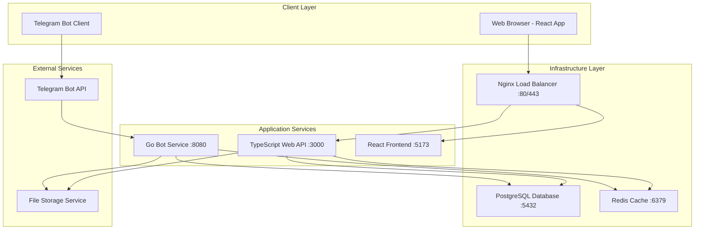
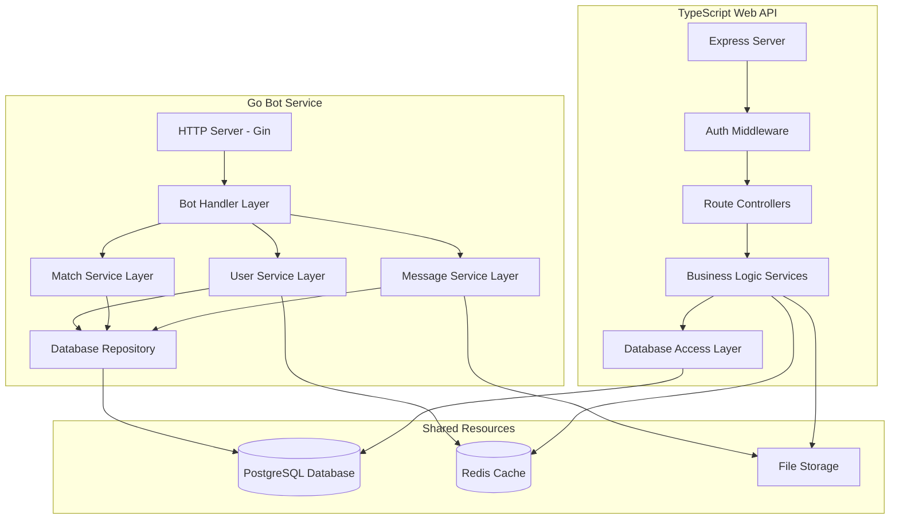
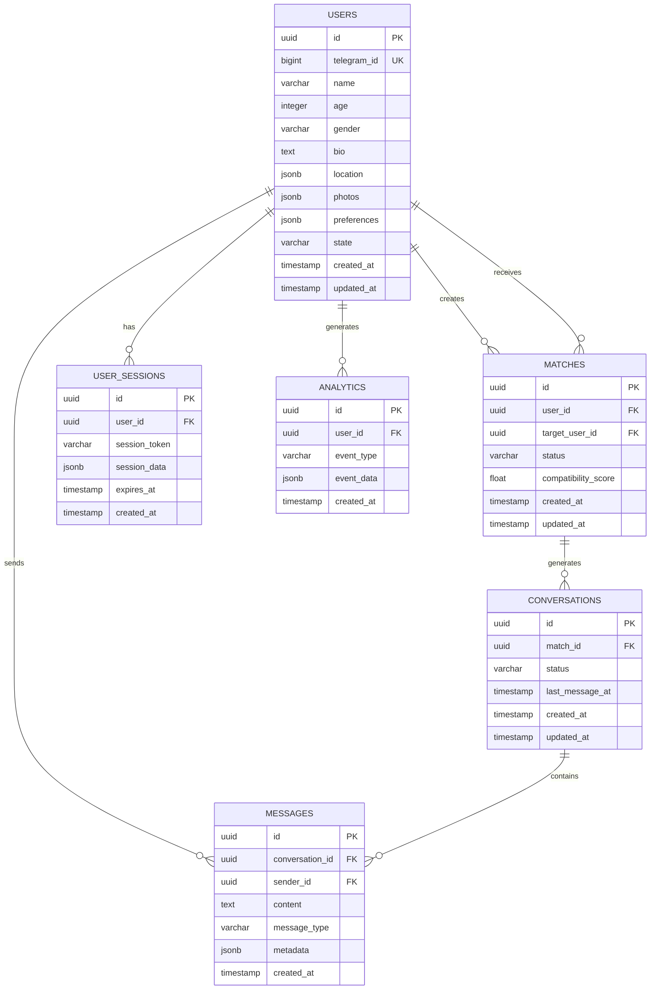

# MeetsMatch - Technical Architecture Document

## 1. Architecture Design



## 2. Technology Description

### Current Implementation Status
- **Go Bot Service**: Go 1.25.0 + Gin framework + go-telegram/bot - **PARTIALLY IMPLEMENTED**
- **Web API**: TypeScript + Node.js + Express + PostgreSQL client - **CONFIGURED ONLY**
- **Frontend**: React 19+ + TypeScript + Vite + Tailwind CSS - **CONFIGURED ONLY**
- **Database**: PostgreSQL 16+ with JSONB support - **FULLY IMPLEMENTED**
- **Cache**: Redis 7+ for sessions and real-time data - **CONFIGURED**
- **Package Management**: Bun 1.2.20 for TypeScript services
- **Containerization**: Docker + Docker Compose - **CONFIGURED**
- **CI/CD**: GitHub Actions with multi-service pipeline - **IMPLEMENTED**

### Core Dependencies

#### Go Bot Service
```go
// Key dependencies from go.mod
require (
    github.com/gin-gonic/gin v1.10.0
    github.com/go-telegram/bot v1.11.1
    github.com/google/uuid v1.6.0
    github.com/lib/pq v1.10.9
)
```

#### TypeScript Web API
```json
{
  "dependencies": {
    "express": "^4.21.2",
    "pg": "^8.13.1",
    "redis": "^4.7.0",
    "bcryptjs": "^2.4.3",
    "jsonwebtoken": "^9.0.2"
  }
}
```

#### React Frontend
```json
{
  "dependencies": {
    "react": "^19.0.0",
    "@tanstack/react-query": "^5.62.7",
    "react-router-dom": "^7.1.1",
    "zustand": "^5.0.2"
  }
}
```

## 3. Route Definitions

### Go Bot Service Routes
| Route | Method | Purpose | Status |
|-------|--------|---------|--------|
| `/webhook` | POST | Telegram webhook endpoint | ✅ Implemented |
| `/health` | GET | Health check endpoint | ✅ Implemented |
| `/api/users` | GET | User management API | ⚠️ Partial |
| `/api/matches` | GET/POST | Matching operations | ❌ Not implemented |
| `/api/messages` | GET/POST | Message handling | ❌ Not implemented |

### TypeScript Web API Routes (Planned)
| Route | Method | Purpose | Status |
|-------|--------|---------|--------|
| `/api/auth/login` | POST | User authentication | ❌ Not implemented |
| `/api/auth/register` | POST | User registration | ❌ Not implemented |
| `/api/users/profile` | GET/PUT | Profile management | ❌ Not implemented |
| `/api/matches` | GET | Browse matches | ❌ Not implemented |
| `/api/messages` | GET/POST | Messaging system | ❌ Not implemented |
| `/api/admin/users` | GET | Admin user management | ❌ Not implemented |

### React Frontend Routes (Planned)
| Route | Purpose | Status |
|-------|---------|--------|
| `/` | Landing page | ❌ Not implemented |
| `/login` | User authentication | ❌ Not implemented |
| `/dashboard` | User dashboard | ❌ Not implemented |
| `/profile` | Profile management | ❌ Not implemented |
| `/matches` | Browse matches | ❌ Not implemented |
| `/messages` | Messaging interface | ❌ Not implemented |
| `/admin` | Admin panel | ❌ Not implemented |

## 4. API Definitions

### 4.1 Go Bot Service API (Implemented)

#### User Management
```
GET /api/users/{id}
```

Response:
| Field | Type | Description |
|-------|------|-------------|
| id | UUID | User unique identifier |
| telegram_id | int64 | Telegram user ID |
| name | string | User display name |
| age | int | User age |
| gender | string | User gender |
| bio | string | User biography |
| location | object | User location data |
| photos | array | User photo URLs |
| preferences | object | Matching preferences |
| created_at | timestamp | Account creation time |

### 4.2 TypeScript Web API (Planned)

#### Authentication
```
POST /api/auth/login
```

Request:
| Field | Type | Required | Description |
|-------|------|----------|-------------|
| email | string | true | User email address |
| password | string | true | User password |

Response:
| Field | Type | Description |
|-------|------|-------------|
| token | string | JWT authentication token |
| user | object | User profile data |
| expires_in | number | Token expiration time |

Example Request:
```json
{
  "email": "user@example.com",
  "password": "securepassword123"
}
```

Example Response:
```json
{
  "token": "eyJhbGciOiJIUzI1NiIsInR5cCI6IkpXVCJ9...",
  "user": {
    "id": "123e4567-e89b-12d3-a456-426614174000",
    "email": "user@example.com",
    "name": "John Doe"
  },
  "expires_in": 3600
}
```

#### Match Operations
```
GET /api/matches
```

Query Parameters:
| Field | Type | Required | Description |
|-------|------|----------|-------------|
| limit | number | false | Number of matches to return (default: 10) |
| offset | number | false | Pagination offset (default: 0) |
| age_min | number | false | Minimum age filter |
| age_max | number | false | Maximum age filter |

Response:
| Field | Type | Description |
|-------|------|-------------|
| matches | array | Array of potential matches |
| total | number | Total available matches |
| has_more | boolean | Whether more matches are available |

## 5. Server Architecture Diagram



## 6. Data Model

### 6.1 Entity Relationship Diagram



### 6.2 Database Schema (DDL)

#### Users Table
```sql
-- Users table with comprehensive profile data
CREATE TABLE users (
    id UUID PRIMARY KEY DEFAULT gen_random_uuid(),
    telegram_id BIGINT UNIQUE NOT NULL,
    name VARCHAR(100) NOT NULL,
    age INTEGER CHECK (age >= 18 AND age <= 100),
    gender VARCHAR(20) CHECK (gender IN ('male', 'female', 'non-binary', 'other')),
    bio TEXT,
    location JSONB,
    photos JSONB DEFAULT '[]'::jsonb,
    preferences JSONB DEFAULT '{}'::jsonb,
    state VARCHAR(50) DEFAULT 'new',
    created_at TIMESTAMP WITH TIME ZONE DEFAULT NOW(),
    updated_at TIMESTAMP WITH TIME ZONE DEFAULT NOW()
);

-- Indexes for performance
CREATE INDEX idx_users_telegram_id ON users(telegram_id);
CREATE INDEX idx_users_age_gender ON users(age, gender);
CREATE INDEX idx_users_location ON users USING GIN(location);
CREATE INDEX idx_users_state ON users(state);
```

#### Matches Table
```sql
-- Matches table for user connections
CREATE TABLE matches (
    id UUID PRIMARY KEY DEFAULT gen_random_uuid(),
    user_id UUID NOT NULL REFERENCES users(id) ON DELETE CASCADE,
    target_user_id UUID NOT NULL REFERENCES users(id) ON DELETE CASCADE,
    status VARCHAR(20) DEFAULT 'pending' CHECK (status IN ('pending', 'accepted', 'rejected', 'expired')),
    compatibility_score FLOAT CHECK (compatibility_score >= 0 AND compatibility_score <= 1),
    created_at TIMESTAMP WITH TIME ZONE DEFAULT NOW(),
    updated_at TIMESTAMP WITH TIME ZONE DEFAULT NOW(),
    UNIQUE(user_id, target_user_id)
);

-- Indexes for match queries
CREATE INDEX idx_matches_user_id ON matches(user_id);
CREATE INDEX idx_matches_target_user_id ON matches(target_user_id);
CREATE INDEX idx_matches_status ON matches(status);
CREATE INDEX idx_matches_score ON matches(compatibility_score DESC);
```

#### Conversations Table
```sql
-- Conversations for matched users
CREATE TABLE conversations (
    id UUID PRIMARY KEY DEFAULT gen_random_uuid(),
    match_id UUID NOT NULL REFERENCES matches(id) ON DELETE CASCADE,
    status VARCHAR(20) DEFAULT 'active' CHECK (status IN ('active', 'archived', 'blocked')),
    last_message_at TIMESTAMP WITH TIME ZONE,
    created_at TIMESTAMP WITH TIME ZONE DEFAULT NOW(),
    updated_at TIMESTAMP WITH TIME ZONE DEFAULT NOW()
);

-- Indexes for conversation queries
CREATE INDEX idx_conversations_match_id ON conversations(match_id);
CREATE INDEX idx_conversations_last_message ON conversations(last_message_at DESC);
```

#### Messages Table
```sql
-- Messages within conversations
CREATE TABLE messages (
    id UUID PRIMARY KEY DEFAULT gen_random_uuid(),
    conversation_id UUID NOT NULL REFERENCES conversations(id) ON DELETE CASCADE,
    sender_id UUID NOT NULL REFERENCES users(id) ON DELETE CASCADE,
    content TEXT NOT NULL,
    message_type VARCHAR(20) DEFAULT 'text' CHECK (message_type IN ('text', 'image', 'file', 'location')),
    metadata JSONB DEFAULT '{}'::jsonb,
    created_at TIMESTAMP WITH TIME ZONE DEFAULT NOW()
);

-- Indexes for message queries
CREATE INDEX idx_messages_conversation_id ON messages(conversation_id);
CREATE INDEX idx_messages_sender_id ON messages(sender_id);
CREATE INDEX idx_messages_created_at ON messages(created_at DESC);
```

#### User Sessions Table
```sql
-- User sessions for web application
CREATE TABLE user_sessions (
    id UUID PRIMARY KEY DEFAULT gen_random_uuid(),
    user_id UUID NOT NULL REFERENCES users(id) ON DELETE CASCADE,
    session_token VARCHAR(255) UNIQUE NOT NULL,
    session_data JSONB DEFAULT '{}'::jsonb,
    expires_at TIMESTAMP WITH TIME ZONE NOT NULL,
    created_at TIMESTAMP WITH TIME ZONE DEFAULT NOW()
);

-- Indexes for session management
CREATE INDEX idx_user_sessions_token ON user_sessions(session_token);
CREATE INDEX idx_user_sessions_user_id ON user_sessions(user_id);
CREATE INDEX idx_user_sessions_expires ON user_sessions(expires_at);
```

#### Analytics Table
```sql
-- Analytics and event tracking
CREATE TABLE analytics (
    id UUID PRIMARY KEY DEFAULT gen_random_uuid(),
    user_id UUID REFERENCES users(id) ON DELETE SET NULL,
    event_type VARCHAR(50) NOT NULL,
    event_data JSONB DEFAULT '{}'::jsonb,
    created_at TIMESTAMP WITH TIME ZONE DEFAULT NOW()
);

-- Indexes for analytics queries
CREATE INDEX idx_analytics_user_id ON analytics(user_id);
CREATE INDEX idx_analytics_event_type ON analytics(event_type);
CREATE INDEX idx_analytics_created_at ON analytics(created_at DESC);
```

#### Triggers for Updated Timestamps
```sql
-- Function to update updated_at timestamp
CREATE OR REPLACE FUNCTION update_updated_at_column()
RETURNS TRIGGER AS $$
BEGIN
    NEW.updated_at = NOW();
    RETURN NEW;
END;
$$ language 'plpgsql';

-- Apply triggers to relevant tables
CREATE TRIGGER update_users_updated_at BEFORE UPDATE ON users
    FOR EACH ROW EXECUTE FUNCTION update_updated_at_column();

CREATE TRIGGER update_matches_updated_at BEFORE UPDATE ON matches
    FOR EACH ROW EXECUTE FUNCTION update_updated_at_column();

CREATE TRIGGER update_conversations_updated_at BEFORE UPDATE ON conversations
    FOR EACH ROW EXECUTE FUNCTION update_updated_at_column();
```

## 7. Implementation Status Summary

### ✅ Fully Implemented
- Database schema and migrations
- Go project structure and basic HTTP server
- User service with CRUD operations
- Database models and repository pattern
- CI/CD pipeline configuration
- Docker containerization setup

### ⚠️ Partially Implemented
- Go bot service (server setup complete, bot logic incomplete)
- Basic API endpoints (structure exists, limited functionality)
- Authentication middleware (foundation laid)

### ❌ Not Implemented
- Telegram bot command handlers
- Matching algorithm implementation
- Message processing and media handling
- TypeScript Web API source code
- React frontend application
- Redis integration
- File storage service
- Production deployment configuration

## 8. Next Steps for Implementation

### Priority 1: Complete Go Bot Service
1. Implement Telegram command handlers (`/start`, `/profile`, `/matches`)
2. Add user registration and profile management flows
3. Implement basic matching algorithm
4. Add message handling and media upload support

### Priority 2: Initialize Web Services
1. Create TypeScript API source structure
2. Implement authentication endpoints
3. Create React application with basic routing
4. Set up state management and API integration

### Priority 3: Integration and Testing
1. Connect all services through proper API calls
2. Implement comprehensive test coverage
3. Set up monitoring and logging
4. Prepare production deployment pipeline

This technical architecture provides a solid foundation for the MeetsMatch platform with clear separation of concerns and scalable design patterns.