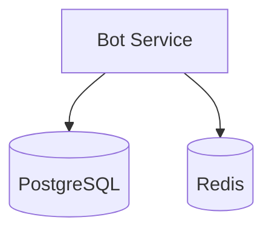
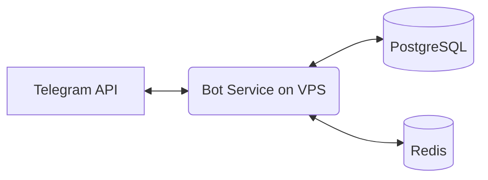
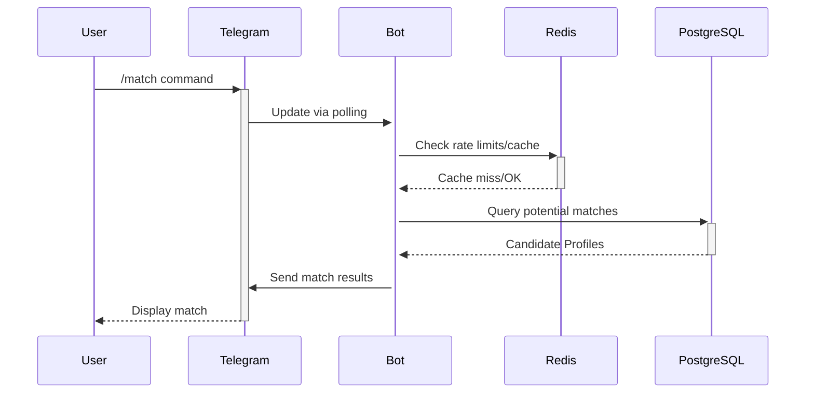

# Technical Documentation for Telegram Bot Project

This document outlines the core technologies, libraries, and tools used in the development and deployment of this Telegram bot on a VPS.

## Core Technologies

* `Python (3.10+)`: Primary language for bot logic running on a VPS.
* `Telegram Bot API`: Interface for creating and interacting with bots.

## Key Libraries and Tools

* `python-telegram-bot (20.0+)`: Python wrapper for the Telegram Bot API. [GitHub](https://github.com/python-telegram-bot/python-telegram-bot)
* `uv` (latest): Manages virtual environment and dependencies.
* `ruff` (latest): Linter and formatter.
* `SQLAlchemy`: ORM for PostgreSQL.
* `Alembic`: Database migrations.
* `redis-py` (optional): Redis client used for caching.
* `geopy` (latest): Location-based matching logic.
* `coverage`: Measures code coverage locally and in CI.
* `Codecov`: Tracks coverage reports integrated with CI.

## Development Environment

* `Virtual Environment`: Isolated Python environment managed by `uv`.
* `Code Editor/IDE`: Python support; project uses `pyproject.toml`.
* `Git`: Version control.
* `.env`: Local and production configuration for secrets and settings.

## CI/CD Tools

* `GitHub Actions`: Automates testing (`pytest`, `coverage`) and static checks.
* `Codecov Integration`: Uploads coverage reports from CI.

## Testing Framework

* `pytest`: Unit and integration tests locally and in CI.
* `coverage.py`: Measures code coverage. Goal: >95%.
* `Codecov`: Tracks coverage and provides reports.

## Code Quality Tools

* `ruff`: Linter and formatter.
* `pylyzer`: Static type checker.
* `Codecov Quality Gates`: Enforce minimum coverage (>95%) for pull requests.

## Monitoring and Analytics

* `Structured Logging`: Implemented via `structlog`.
* `System Logs`: Production logs available via `journalctl -u meetsmatch`.
* `Codecov Trends`: Tracks code coverage trends.

## Deployment

* `VPS + systemd`: Bot runs as a systemd service (`meetsmatch.service`).
* `EnvironmentFile`: `.env` loaded by the service.
* `PostgreSQL`: Managed on the VPS; migrations handled via `Alembic`.
* `Redis` (optional): Used for caching if configured.

## Key Concepts

* `Asynchronous Programming`: Handling Telegram events asynchronously.
* `Polling`: Bot runs in polling mode; no Cloudflare Worker/webhook.
* `Command Handlers`: Logic for specific user commands.
* `Conversation Handlers`: Managing multi-step interactions.
* `Environment Variables`: Secrets (e.g., Telegram Bot Token) managed via `.env`.

## Data Persistence

* `PostgreSQL`: Structured data (users, profiles, matches).
* `Redis` (optional): Ephemeral data (session state, rate limits, cache).
* `Backups`: Use PostgreSQL backup tools/policies at the VPS level.

## Database Architecture

### VPS Components Used
1. `systemd`: Service management
2. `PostgreSQL`: Relational database
3. `Redis` (optional): Cache

# Technical Architecture Deep Dive

## System Components

## Service Interactions (Example: Match Request)

## Performance Metrics (Targets)
| Component          | Target Latency | Error Budget |
|--------------------|----------------|--------------|
| Bot Response       | <500ms         | 99.9% Success|
| DB Query (P95)     | <100ms         | -            |
| Cache Read/Write   | <10ms          | 99.99% Success|

## Monitoring Stack
1. `System Logs`:
   - `journalctl -u meetsmatch` for service logs
   - PostgreSQL/Redis logs per their services
2. `Codecov`:
   - Coverage reports & trends
3. `External Observability (Optional)`:
   - Integrate if needed (e.g., Datadog, Sentry)
