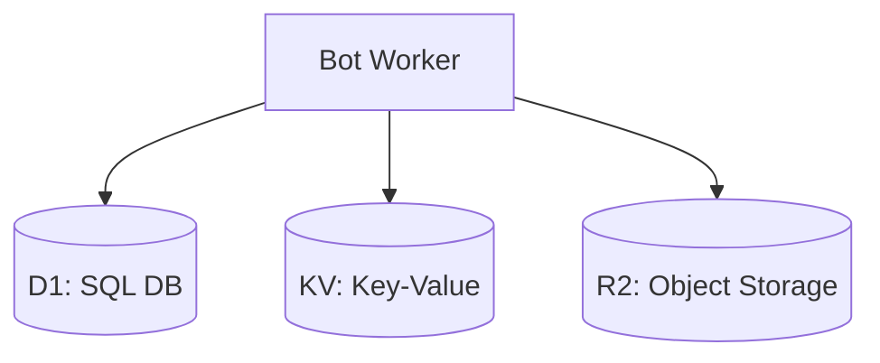
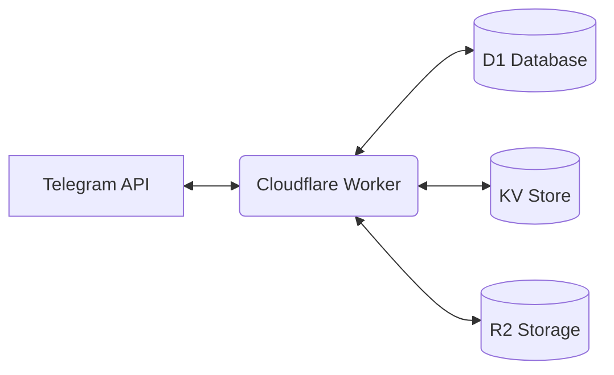
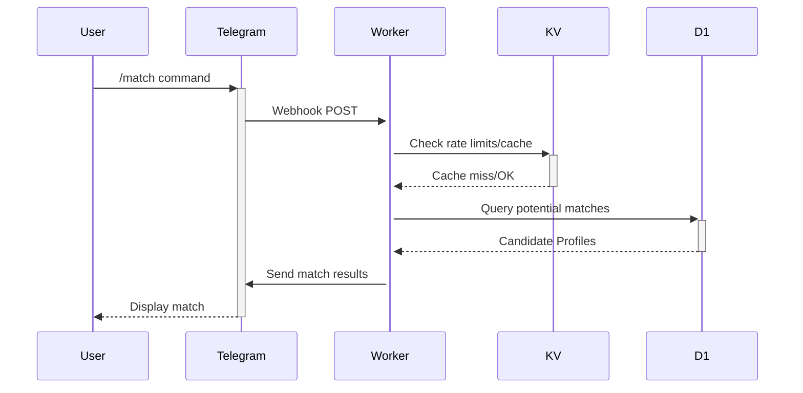

# Technical Documentation for Telegram Bot Project

This document outlines the core technologies, libraries, and tools used in the development of this Telegram bot.

## Core Technologies

* **TypeScript:** The primary programming language for the bot's logic and functionality.
* **Bun:** JavaScript runtime, package manager, and test runner used for local development and testing.
* **Telegram Bot API:** The interface provided by Telegram for creating and interacting with bots.
* **Cloudflare Workers:** Serverless execution environment for running the bot logic globally.
* **Cloudflare D1:** Serverless SQL database (SQLite compatible) for persistent relational data.
* **Cloudflare KV:** Global, low-latency key-value store for caching, session data, or configuration.
* **Cloudflare R2 (Optional):** S3-compatible object storage, potentially for media files if KV is insufficient.

## Key Libraries and Tools

* **`GrammyJS` (Latest Version):** A comprehensive TypeScript framework for the Telegram Bot API. [Website](https://grammy.dev/)
* **`Bun` (Latest Version):** Used locally for package management, running scripts, and testing.
* **`Biome` (Latest Version):** Linter and formatter for maintaining code quality locally.
* **`wrangler` (Latest Version):** CLI tool for developing, testing, and deploying Cloudflare Workers, D1, KV, and R2 resources.
* **Cloudflare D1 Client:** Interaction with D1 is typically done via Wrangler bindings provided in the Worker environment (`env.DB`). No separate client library is necessarily needed within the Worker code, though ORMs compatible with D1 might be used locally or for migrations.
* **Geolocation Library (TBD):** A suitable TypeScript/JavaScript library if complex geolocation logic is needed (e.g., `geolib`).
* **Bun Test Runner:** Built-in test runner includes coverage reporting.
* **Codecov:** Service for tracking code coverage reports, integrated with CI.

## Development Environment

* **Node.js/Bun:** Required for running Bun commands and Wrangler.
* **Code Editor/IDE:** Supporting TypeScript, TOML (`wrangler.toml`), `.env`/`.dev.vars`.
* **Git:** Version control.
* **`wrangler` CLI:** For local development (`wrangler dev`) and deployment.

## CI/CD Tools

* **GitHub Actions:** Automating testing (using `bun test --coverage`) and deployment (using `wrangler deploy`).
* **Codecov Integration:** Uploading coverage reports from GitHub Actions.

## Testing Framework

* **Bun Test:** Built-in test runner for unit and integration tests run locally and in CI. Includes coverage support (`bun test --coverage`). Goal: >95% coverage.
* **Codecov:** Tracking coverage and providing reports.

## Code Quality Tools

* **Biome:** Integrated linter and formatter (`bun run lint`, `bun run format`). Configured via `biome.json`.
* **TypeScript Compiler (`tsc`):** Used via `bun build` or `bun check` for static type checking during development and CI.
* **Codecov Quality Gates:** Enforcing minimum code coverage (>95%) for pull requests.

## Monitoring and Analytics

* **Cloudflare Workers Analytics:** Built-in metrics for requests, CPU time, errors within the Cloudflare dashboard.
* **Cloudflare Logs:** Access to Worker logs for debugging.
* **Custom Logging:** Implementing logging within the Worker to send data to external observability platforms if needed.
* **Codecov Trends:** Tracks code coverage trends.

## Deployment

* **Cloudflare Worker:** The bot logic is deployed as a Worker script.
* **`wrangler.toml`:** Configuration file defining Worker settings, bindings to D1, KV, R2, and environment variables.
* **Cloudflare D1:** Database migrations managed via `wrangler d1 execute` or integrated migration tools.
* **Cloudflare KV/R2:** Provisioned and managed via the Cloudflare dashboard or `wrangler`.

## Key Concepts

* **Asynchronous Programming (`async`/`await`):** Handling Telegram events and I/O operations asynchronously within the Worker runtime using TypeScript's async/await syntax.
* **Update Handling:** Processing Telegram updates via webhook configured to the Worker URL, typically managed by the GrammyJS framework.
* **Command Handlers:** Logic for specific user commands (`/start`, `/match`, etc.) using GrammyJS listeners (`bot.command`).
* **Conversation Handlers:** Managing multi-step interactions (e.g., profile setup) potentially using GrammyJS conversations plugin or custom state management.
* **Cloudflare Bindings:** Securely accessing D1, KV, and R2 resources from within the Worker code via predefined bindings.
* **Worker Environment Variables:** Managing secrets like the Telegram Bot Token.

## Data Persistence

* **Cloudflare D1:** Storing structured data (users, profiles, matches).
* **Cloudflare KV:** Storing ephemeral data (session state, rate limits, cache).
* **Cloudflare R2 (Potentially):** Storing media file blobs.
* **Data Backup and Recovery:** Utilizing Cloudflare's built-in D1 backup features.

## Database Architecture

### Cloudflare Features Used:
1. **Workers:** Serverless compute
2. **D1:** Relational Database
3. **KV:** Key-Value Store
4. **R2:** Object Storage (Optional)
5. **Wrangler:** CLI for development & deployment

# Technical Architecture Deep Dive

## System Components

## Service Interactions (Example: Match Request)

## Performance Metrics (Targets)
| Component         | Target Latency | Error Budget |
|-------------------|----------------|--------------|
| Worker Response   | <500ms         | 99.9% Success|
| D1 Query (P95)    | <100ms         | -            |
| KV Read/Write     | <10ms          | 99.99% Success|

## Monitoring Stack
1. **Cloudflare Dashboard:**
   - Worker Analytics (requests, CPU, errors)
   - D1 Query Stats
   - KV Operations
2. **Codecov:**
   - Coverage reports & trends
3. **Custom Logging (Optional):**
   - Worker logs pushed to external system (e.g., Datadog, Sentry)
