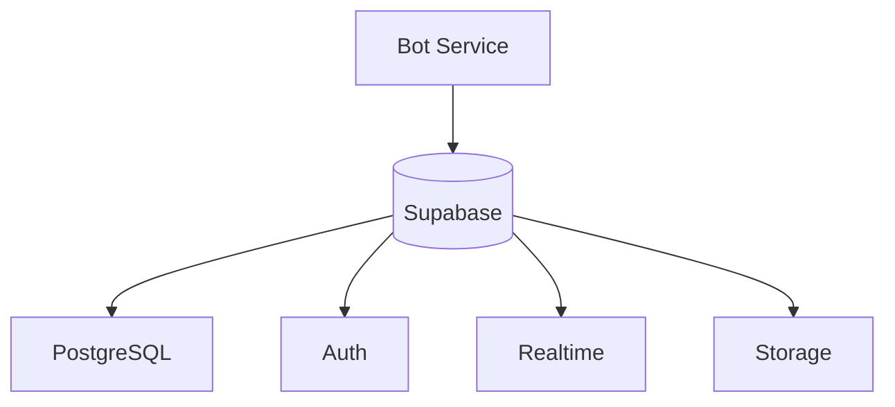
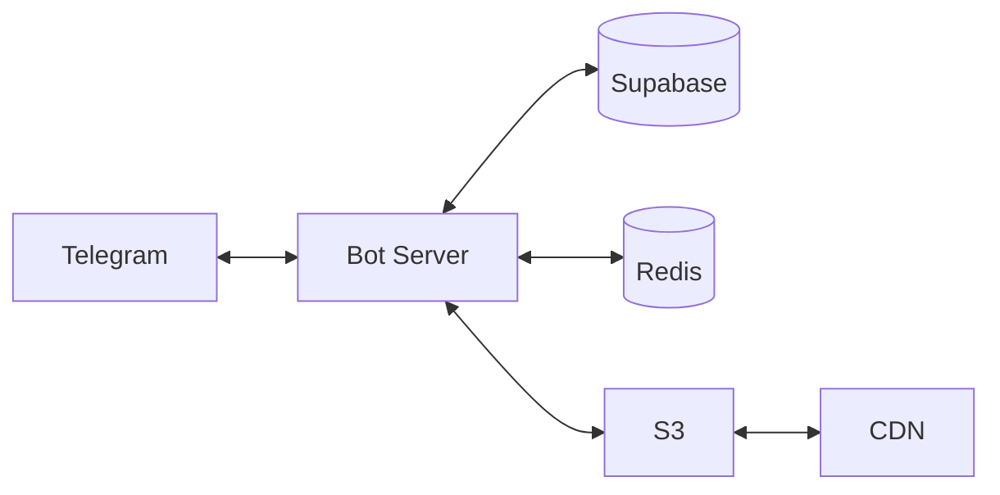
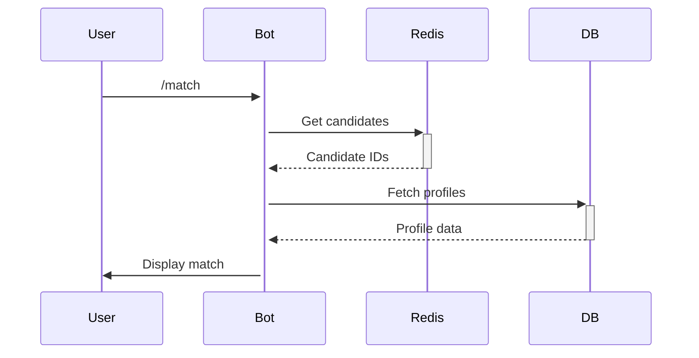

# Technical Documentation for Telegram Bot Project

This document outlines the core technologies, libraries, and tools used in the development of this Telegram bot.

## Core Technologies

* **Python (3.10+):** The primary programming language for the bot's logic and functionality. Leveraging modern features and security updates.
* **Telegram Bot API:** The interface provided by Telegram for creating and interacting with bots. Understanding its methods and data structures is crucial.
* **Supabase:** Open-source Firebase alternative providing PostgreSQL database, authentication, and realtime functionality
* **Redis:** In-memory data store for real-time matching operations
* **S3-Compatible Storage:** Object storage for media assets (using DigitalOcean Spaces)

## Key Libraries and Tools

* **`python-telegram-bot` (20.0+):** A comprehensive Python wrapper for the Telegram Bot API. This library simplifies asynchronous programming, handling updates, and managing bot interactions efficiently. [GitHub Repository](https://github.com/python-telegram-bot/python-telegram-bot)
* **`uv` (Latest Version):** A fast and modern Python package installer and resolver, used for managing the project's virtual environment and dependencies. Offers performance benefits over `pip`.
* **`ruff` (Latest Version):** An extremely fast Python linter and formatter, used to enforce code quality, consistency, and catch potential errors. Replaces tools like `flake8`, `isort`, and `pydocstyle`.
* **Docker:** A platform for building, sharing, and running applications in containers. Used for packaging the bot and its dependencies for consistent deployment.
* **SQLAlchemy:** An SQL toolkit and Object-Relational Mapping (ORM) library for Python, used for database interactions with Supabase.
* **Boto3:** The Amazon Web Services (AWS) SDK for Python, used for interacting with Amazon S3.
* **`geopy` (Latest Version):** A Python library that provides geocoding and reverse geocoding functionalities. It will be used for location-based matching, specifically to determine the country of a given city and to implement the expanded matching criteria (nearby cities, country, nearby countries). [GitHub Repository](https://github.com/geopy/geopy)
* **`coverage` (Latest Version):** A tool for measuring code coverage of Python programs. Used to identify which parts of the codebase are being tested and which need more testing.
* **Codecov:** A tool that provides detailed code coverage reports and integrates with GitHub CI/CD. Used to track code coverage over time and ensure high testing standards.

## Development Environment

* **Virtual Environment:** Isolated Python environment (created using `uv`) to manage project-specific dependencies and avoid conflicts with system-wide packages.
* **Code Editor/IDE:** The specific editor or IDE is flexible but should support Python development and integrate with the project's linting and formatting tools.
* **Git:** Version control system for tracking changes and collaborating with other developers.

## CI/CD Tools

* **GitHub Actions:** Used for automating the build, test, and deployment processes.
* **Codecov Integration:** Integrated with GitHub Actions to provide code coverage reports on pull requests and track coverage trends.
* **Docker Hub:** Container registry for storing and distributing Docker images.

## Testing Framework

* **unittest:** Python's built-in testing framework used for writing and running tests.
* **coverage.py:** Used for measuring code coverage during test execution.
* **Codecov GitHub App:** Provides detailed coverage reports and PR comments with coverage changes.

## Code Quality Tools

* **ruff:** Fast Python linter and formatter.
* **pylyzer:** Static type checker for Python code.
* **Codecov Quality Gates:** Enforces minimum code coverage requirements for pull requests.

## Monitoring and Analytics

* **Telegram Bot Analytics:** Built-in analytics for monitoring bot usage and performance.
* **AWS CloudWatch:** Used for monitoring application logs and metrics.
* **Codecov Trends:** Tracks code coverage trends over time to maintain quality standards.

## Deployment

* **Docker Container:** The bot will be packaged as a Docker container, ensuring consistent execution across different environments.
* **Container Registry:** A service (e.g., Docker Hub, GitHub Container Registry) may be used to store and distribute the Docker image.
* **Container Orchestration (Optional):** For more complex deployments, tools like Docker Compose or Kubernetes might be considered, though not explicitly required by the initial request.
* **Database Hosting:** A Supabase instance, either self-hosted or using a cloud provider's managed service.
* **S3 Bucket:** An Amazon S3 bucket configured for the bot's storage needs.

## Key Concepts

* **Asynchronous Programming:** The bot utilizes `python-telegram-bot`'s asynchronous capabilities to handle multiple incoming messages and events concurrently without blocking.
* **Update Handling:** The mechanism for the bot to receive and process events from Telegram (e.g., new messages, commands, inline queries) using the library's `Updater` and `Dispatcher` classes.
* **Command Handlers:** Functions or methods dedicated to processing specific user commands (e.g., `/start`, `/help`) using the `CommandHandler` class.
* **Conversation Handlers:** Manage multi-step interactions or dialog flows with users using the `ConversationHandler` class.
* **Inline Queries:** Functionality allowing users to interact with the bot directly from their chat input field, providing suggestions or actions using the `InlineQueryHandler` class.
* **Database Operations:** Using SQLAlchemy to interact with Supabase for storing and retrieving structured data.
* **S3 Operations:** Using Boto3 to interact with Amazon S3 for storing and retrieving unstructured data or large files.

## Data Persistence

* **Supabase Database:** Used for storing structured data such as user information, bot states, and other relational data.
* **Amazon S3:** Used for storing larger files, backups, or any unstructured data that the bot might need to handle.
* **Connection Pooling:** Implement connection pooling for efficient database connections.
* **Data Backup and Recovery:** Regular backups of Supabase data and S3 objects, with a defined recovery process.

## Database Architecture

### Supabase Features Used:
1. **Row-Level Security:** Granular access controls
2. **Postgres Functions:** Server-side matching logic
3. **Realtime API:** Instant match notifications
4. **Storage API:** Media file management

# Technical Architecture Deep Dive

## System Components

## Service Interactions

## Performance Metrics
| Component         | Target Latency | Error Budget |
|-------------------|----------------|--------------|
| API Response      | <500ms         | 99.9% SLA    |
| Match Generation  | <2s            | 95th %ile    |
| Media Upload      | <1s/MB         | 99% Success  |

## Monitoring Stack
1. **Application Metrics**
   - Prometheus: Request rates, error ratios
   - Grafana: Dashboards
   
2. **Business Metrics**
   - Daily active matches
   - Conversion funnel
