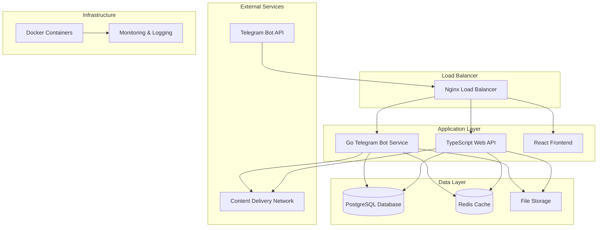

# Product Requirements Document (PRD)
# MeetsMatch Telegram Bot - Go/TypeScript Edition

## Table of Contents
- [Executive Summary](#executive-summary)
- [Product Overview](#product-overview)
- [Technical Architecture](#technical-architecture)
- [Core Features](#core-features)
- [Service Architecture](#service-architecture)
- [Data Architecture](#data-architecture)
- [Security and Privacy](#security-and-privacy)
- [Performance Requirements](#performance-requirements)
- [Deployment and Operations](#deployment-and-operations)
- [Success Metrics](#success-metrics)
- [Timeline and Milestones](#timeline-and-milestones)

## Executive Summary

MeetsMatch is a sophisticated Telegram bot designed to facilitate meaningful connections between users through intelligent matching algorithms and seamless communication features. This document outlines the complete rewrite of the MeetsMatch platform using a modern, scalable architecture built with Go, TypeScript, and Docker.

### Key Objectives
- **Scalability**: Support thousands of concurrent users with horizontal scaling capabilities
- **Performance**: Sub-second response times for all user interactions
- **Reliability**: 99.9% uptime with robust error handling and recovery
- **Security**: End-to-end encryption and comprehensive data protection
- **User Experience**: Intuitive interface with rich media support and real-time features

### Technology Stack Migration
The platform has been completely rewritten from the previous Rust/Cloudflare Workers implementation to a more traditional but robust microservices architecture:

- **Previous**: Rust + Cloudflare Workers + D1 + KV + R2
- **Current**: Go + TypeScript + PostgreSQL + Redis + Docker + Nginx

## Product Overview

### Vision
To create the most intelligent and user-friendly dating platform within the Telegram ecosystem, leveraging advanced matching algorithms and seamless communication tools.

### Target Audience
- **Primary**: Adults aged 18-35 seeking meaningful relationships
- **Secondary**: Professionals looking for networking opportunities
- **Geographic**: Global reach with initial focus on English-speaking markets

### Core Value Propositions
1. **Intelligent Matching**: ML-powered algorithm considering compatibility factors
2. **Privacy-First**: All interactions within Telegram's secure ecosystem
3. **Rich Media Support**: Photos, videos, voice messages, and location sharing
4. **Real-Time Communication**: Instant messaging with read receipts and typing indicators
5. **Advanced Filtering**: Comprehensive preference settings and search capabilities

## Technical Architecture

### High-Level Architecture



### Core Technologies

#### Backend Services
- **Go 1.21+**: High-performance Telegram bot service
- **TypeScript/Node.js**: RESTful API service with Express.js
- **PostgreSQL 18+**: Primary relational database
- **Redis 7+**: Caching, session management, and real-time features
- **Docker**: Containerization and orchestration
- **Nginx**: Load balancing and reverse proxy

#### Frontend
- **React 18+**: Modern web interface for administration
- **TypeScript**: Type-safe frontend development
- **Vite**: Fast build tool and development server
- **Tailwind CSS**: Utility-first styling framework

#### Infrastructure
- **Docker Compose**: Local development environment
- **GitHub Actions**: CI/CD pipeline
- **Prometheus**: Metrics collection
- **Grafana**: Monitoring dashboards
- **ELK Stack**: Centralized logging

## Core Features

### 1. User Management

#### User Registration and Onboarding
- **Telegram Integration**: Seamless registration via Telegram account
- **Profile Creation**: Step-by-step guided profile setup
- **Photo Upload**: Multiple profile photos with automatic optimization
- **Verification System**: Optional identity verification for enhanced trust
- **Privacy Controls**: Granular privacy settings and visibility options

#### Profile Management
- **Rich Profiles**: Comprehensive user information including:
  - Basic demographics (age, location, occupation)
  - Interests and hobbies
  - Relationship preferences
  - Lifestyle choices
  - Personal description and bio
- **Media Gallery**: Photo and video management
- **Profile Visibility**: Control who can see profile information
- **Activity Status**: Online/offline indicators and last seen

### 2. Intelligent Matching System

#### Matching Algorithm
- **Multi-Factor Analysis**: Considers multiple compatibility dimensions:
  - Geographic proximity
  - Age preferences
  - Shared interests
  - Lifestyle compatibility
  - Communication patterns
  - Activity levels
- **Machine Learning**: Continuously improving algorithm based on user feedback
- **Preference Weighting**: User-defined importance for different matching criteria
- **Compatibility Scoring**: Numerical compatibility ratings with explanations

#### Matching Features
- **Daily Matches**: Curated daily match suggestions
- **Discovery Mode**: Browse potential matches with advanced filters
- **Mutual Matching**: Both users must express interest to enable communication
- **Match Expiration**: Time-limited matches to encourage engagement
- **Rematch System**: Ability to reconnect with previous matches

### 3. Communication System

#### Messaging Features
- **Text Messages**: Rich text formatting and emoji support
- **Media Sharing**: Photos, videos, voice messages, and documents
- **Location Sharing**: Share current location or custom locations
- **Message Reactions**: React to messages with emojis
- **Message Threading**: Reply to specific messages
- **Message Encryption**: End-to-end encryption for sensitive communications

#### Real-Time Features
- **Typing Indicators**: Show when someone is typing
- **Read Receipts**: Message delivery and read confirmations
- **Online Status**: Real-time presence indicators
- **Push Notifications**: Instant notifications for new messages
- **Message Sync**: Seamless synchronization across devices

#### Conversation Management
- **Chat History**: Persistent message history
- **Message Search**: Find specific messages within conversations
- **Conversation Archiving**: Archive inactive conversations
- **Block and Report**: Safety features for unwanted interactions
- **Conversation Analytics**: Insights into communication patterns

### 4. Advanced Features

#### Social Features
- **Icebreakers**: AI-generated conversation starters
- **Common Interests**: Highlight shared interests and activities
- **Mutual Connections**: Show mutual friends or connections
- **Social Proof**: Display verified information and achievements
- **Group Events**: Organize and participate in group activities

#### Gamification
- **Profile Completeness**: Encourage complete profiles with progress indicators
- **Activity Streaks**: Reward consistent app usage
- **Achievement Badges**: Unlock badges for various milestones
- **Compatibility Challenges**: Fun quizzes to improve matching
- **Leaderboards**: Optional social rankings and competitions

#### Premium Features
- **Unlimited Likes**: Remove daily like limits
- **Advanced Filters**: Additional search and filter options
- **Priority Matching**: Higher visibility in match queues
- **Read Receipts**: See when messages are read
- **Incognito Mode**: Browse profiles without being seen
- **Boost Feature**: Temporarily increase profile visibility

### 5. Safety and Moderation

#### Content Moderation
- **Automated Screening**: AI-powered content filtering
- **Human Review**: Manual review for flagged content
- **Community Guidelines**: Clear rules and enforcement
- **Appeal Process**: Fair review process for moderation decisions
- **Proactive Monitoring**: Continuous monitoring for inappropriate behavior

#### User Safety
- **Verification System**: Identity verification options
- **Report and Block**: Easy reporting of inappropriate behavior
- **Safety Tips**: Educational content about online dating safety
- **Emergency Features**: Quick access to safety resources
- **Data Protection**: Comprehensive privacy controls

## Service Architecture

### Go Telegram Bot Service

#### Core Responsibilities
- **Telegram API Integration**: Handle all Telegram bot interactions
- **Command Processing**: Process user commands and callbacks
- **Message Handling**: Manage incoming and outgoing messages
- **Media Processing**: Handle photo, video, and document uploads
- **Real-Time Features**: WebSocket connections for live updates
- **Background Jobs**: Scheduled tasks and batch processing

#### Key Components
```go
// Core service structure
type BotService struct {
    bot           *bot.Bot
    db            *sql.DB
    redis         *redis.Client
    userService   *UserService
    matchService  *MatchService
    messageService *MessageService
    mediaService  *MediaService
}

// Main handlers
- CommandHandler: Process bot commands (/start, /profile, /matches)
- CallbackHandler: Handle inline keyboard callbacks
- MessageHandler: Process text and media messages
- WebhookHandler: Receive Telegram webhook updates
```

#### Performance Features
- **Connection Pooling**: Efficient database connection management
- **Caching Strategy**: Redis-based caching for frequent operations
- **Rate Limiting**: Protect against API abuse
- **Graceful Shutdown**: Clean service termination
- **Health Checks**: Service health monitoring endpoints

### TypeScript Web API Service

#### Core Responsibilities
- **RESTful API**: Provide HTTP API for web interface
- **Authentication**: JWT-based authentication system
- **Data Validation**: Request/response validation and sanitization
- **Business Logic**: Core application logic and workflows
- **External Integrations**: Third-party service integrations
- **Admin Interface**: Administrative functions and analytics

#### API Endpoints
```typescript
// Authentication
POST /api/auth/login
POST /api/auth/logout
POST /api/auth/refresh

// User Management
GET /api/users/profile
PUT /api/users/profile
POST /api/users/photos
DELETE /api/users/photos/:id

// Matching
GET /api/matches
POST /api/matches/:id/like
POST /api/matches/:id/pass
GET /api/matches/suggestions

// Messaging
GET /api/conversations
GET /api/conversations/:id/messages
POST /api/conversations/:id/messages
PUT /api/conversations/:id/read

// Admin
GET /api/admin/users
GET /api/admin/analytics
PUT /api/admin/feature-flags
```

#### Security Features
- **JWT Authentication**: Secure token-based authentication
- **Rate Limiting**: API endpoint protection
- **Input Validation**: Comprehensive request validation
- **CORS Configuration**: Cross-origin request handling
- **Security Headers**: HTTP security headers implementation

### React Frontend Service

#### Core Features
- **Admin Dashboard**: Comprehensive administrative interface
- **User Management**: User account management and moderation
- **Analytics Dashboard**: Real-time metrics and insights
- **Content Moderation**: Review and moderate user content
- **Feature Flag Management**: Dynamic feature control
- **System Monitoring**: Service health and performance monitoring

#### Key Components
```typescript
// Main application structure
- Dashboard: Overview metrics and quick actions
- UserManagement: User profiles, verification, and moderation
- Analytics: Detailed usage statistics and trends
- ContentModeration: Review flagged content and user reports
- FeatureFlags: Manage feature toggles and configurations
- SystemHealth: Monitor service status and performance
```

## Data Architecture

### PostgreSQL Database Schema

#### Core Tables

**Users Table**
```sql
CREATE TABLE users (
    id UUID PRIMARY KEY DEFAULT gen_random_uuid(),
    telegram_id BIGINT UNIQUE NOT NULL,
    username VARCHAR(255),
    first_name VARCHAR(255) NOT NULL,
    last_name VARCHAR(255),
    email VARCHAR(255),
    phone VARCHAR(20),
    date_of_birth DATE,
    gender VARCHAR(20),
    location_lat DECIMAL(10, 8),
    location_lng DECIMAL(11, 8),
    location_name VARCHAR(255),
    bio TEXT,
    occupation VARCHAR(255),
    education VARCHAR(255),
    height INTEGER,
    relationship_status VARCHAR(50),
    looking_for VARCHAR(50),
    interests TEXT[],
    languages TEXT[],
    is_verified BOOLEAN DEFAULT FALSE,
    is_premium BOOLEAN DEFAULT FALSE,
    is_active BOOLEAN DEFAULT TRUE,
    last_active TIMESTAMP WITH TIME ZONE,
    created_at TIMESTAMP WITH TIME ZONE DEFAULT NOW(),
    updated_at TIMESTAMP WITH TIME ZONE DEFAULT NOW()
);
```

**Matches Table**
```sql
CREATE TABLE matches (
    id UUID PRIMARY KEY DEFAULT gen_random_uuid(),
    user1_id UUID NOT NULL REFERENCES users(id),
    user2_id UUID NOT NULL REFERENCES users(id),
    user1_liked BOOLEAN DEFAULT FALSE,
    user2_liked BOOLEAN DEFAULT FALSE,
    is_mutual BOOLEAN DEFAULT FALSE,
    compatibility_score DECIMAL(3, 2),
    matched_at TIMESTAMP WITH TIME ZONE,
    expires_at TIMESTAMP WITH TIME ZONE,
    created_at TIMESTAMP WITH TIME ZONE DEFAULT NOW(),
    updated_at TIMESTAMP WITH TIME ZONE DEFAULT NOW(),
    UNIQUE(user1_id, user2_id)
);
```

**Conversations Table**
```sql
CREATE TABLE conversations (
    id UUID PRIMARY KEY DEFAULT gen_random_uuid(),
    match_id UUID NOT NULL REFERENCES matches(id),
    last_message_id UUID,
    last_message_at TIMESTAMP WITH TIME ZONE,
    is_archived BOOLEAN DEFAULT FALSE,
    created_at TIMESTAMP WITH TIME ZONE DEFAULT NOW(),
    updated_at TIMESTAMP WITH TIME ZONE DEFAULT NOW()
);
```

**Messages Table**
```sql
CREATE TABLE messages (
    id UUID PRIMARY KEY DEFAULT gen_random_uuid(),
    conversation_id UUID NOT NULL REFERENCES conversations(id),
    sender_id UUID NOT NULL REFERENCES users(id),
    message_type VARCHAR(50) NOT NULL DEFAULT 'text',
    content TEXT,
    media_url VARCHAR(500),
    media_type VARCHAR(50),
    reply_to_id UUID REFERENCES messages(id),
    is_read BOOLEAN DEFAULT FALSE,
    read_at TIMESTAMP WITH TIME ZONE,
    is_deleted BOOLEAN DEFAULT FALSE,
    created_at TIMESTAMP WITH TIME ZONE DEFAULT NOW()
);
```

**User Preferences Table**
```sql
CREATE TABLE user_preferences (
    id UUID PRIMARY KEY DEFAULT gen_random_uuid(),
    user_id UUID NOT NULL REFERENCES users(id),
    min_age INTEGER DEFAULT 18,
    max_age INTEGER DEFAULT 99,
    max_distance INTEGER DEFAULT 50,
    preferred_genders TEXT[],
    relationship_types TEXT[],
    deal_breakers TEXT[],
    must_haves TEXT[],
    notification_settings JSONB DEFAULT '{}',
    privacy_settings JSONB DEFAULT '{}',
    created_at TIMESTAMP WITH TIME ZONE DEFAULT NOW(),
    updated_at TIMESTAMP WITH TIME ZONE DEFAULT NOW(),
    UNIQUE(user_id)
);
```

**Media Files Table**
```sql
CREATE TABLE media_files (
    id UUID PRIMARY KEY DEFAULT gen_random_uuid(),
    user_id UUID NOT NULL REFERENCES users(id),
    file_type VARCHAR(50) NOT NULL,
    file_size INTEGER,
    file_url VARCHAR(500) NOT NULL,
    thumbnail_url VARCHAR(500),
    is_profile_photo BOOLEAN DEFAULT FALSE,
    display_order INTEGER DEFAULT 0,
    is_verified BOOLEAN DEFAULT FALSE,
    created_at TIMESTAMP WITH TIME ZONE DEFAULT NOW()
);
```

#### Database Optimization
- **Indexing Strategy**: Optimized indexes for common queries
- **Partitioning**: Table partitioning for large datasets
- **Connection Pooling**: Efficient connection management
- **Query Optimization**: Optimized queries and stored procedures
- **Backup Strategy**: Automated backups and point-in-time recovery

### Redis Cache Architecture

#### Caching Strategy
```redis
# User sessions
user:session:{user_id} -> {session_data}

# User profiles (frequently accessed)
user:profile:{user_id} -> {profile_json}

# Match suggestions cache
user:matches:{user_id} -> {match_ids_array}

# Feature flags
feature:{flag_name} -> {flag_value}

# Rate limiting
rate_limit:{user_id}:{endpoint} -> {request_count}

# Real-time presence
user:online:{user_id} -> {timestamp}

# Message queues
queue:notifications -> {notification_jobs}
queue:matching -> {matching_jobs}
```

#### Performance Features
- **TTL Management**: Automatic cache expiration
- **Cache Warming**: Preload frequently accessed data
- **Cache Invalidation**: Smart cache invalidation strategies
- **Memory Optimization**: Efficient memory usage patterns
- **Clustering**: Redis cluster for high availability

## Security and Privacy

### Data Protection

#### Encryption
- **Data at Rest**: AES-256 encryption for sensitive data
- **Data in Transit**: TLS 1.3 for all communications
- **Message Encryption**: End-to-end encryption for private messages
- **Key Management**: Secure key rotation and management
- **Database Encryption**: Transparent database encryption

#### Privacy Controls
- **Data Minimization**: Collect only necessary information
- **User Consent**: Explicit consent for data collection
- **Data Retention**: Automatic data deletion policies
- **Right to Deletion**: User-initiated data deletion
- **Data Portability**: Export user data on request

### Authentication and Authorization

#### Multi-Factor Authentication
- **Telegram Integration**: Leverage Telegram's security
- **JWT Tokens**: Secure token-based authentication
- **Session Management**: Secure session handling
- **Device Tracking**: Monitor and manage device access
- **Suspicious Activity**: Detect and prevent unauthorized access

#### Access Control
- **Role-Based Access**: Different permission levels
- **API Rate Limiting**: Prevent abuse and attacks
- **IP Whitelisting**: Restrict access by IP address
- **Audit Logging**: Comprehensive access logging
- **Security Monitoring**: Real-time security monitoring

### Content Safety

#### Automated Moderation
- **AI Content Filtering**: Automatic inappropriate content detection
- **Image Recognition**: Detect inappropriate images
- **Text Analysis**: Analyze text for harmful content
- **Behavioral Analysis**: Detect suspicious user behavior
- **Real-Time Monitoring**: Continuous content monitoring

#### Human Moderation
- **Review Queue**: Flagged content review system
- **Moderator Tools**: Comprehensive moderation interface
- **Appeal Process**: Fair review and appeal system
- **Community Guidelines**: Clear rules and enforcement
- **Training Programs**: Moderator training and certification

## Performance Requirements

### Response Time Targets
- **Bot Commands**: < 500ms response time
- **Message Delivery**: < 200ms for text messages
- **Match Suggestions**: < 1s for personalized matches
- **Profile Loading**: < 800ms for complete profiles
- **Search Results**: < 1.5s for filtered searches
- **Media Upload**: < 5s for image processing

### Scalability Targets
- **Concurrent Users**: Support 10,000+ concurrent users
- **Daily Active Users**: Handle 100,000+ daily active users
- **Messages per Second**: Process 1,000+ messages per second
- **Database Queries**: Handle 10,000+ queries per second
- **File Storage**: Support petabyte-scale media storage
- **Geographic Distribution**: Multi-region deployment capability

### Availability Requirements
- **Uptime**: 99.9% availability (8.76 hours downtime per year)
- **Recovery Time**: < 5 minutes for service recovery
- **Data Backup**: Real-time data replication
- **Disaster Recovery**: < 1 hour recovery time objective
- **Monitoring**: 24/7 system monitoring and alerting

## Deployment and Operations

### Infrastructure

#### Containerization
```yaml
# docker-compose.yml structure
services:
  bot:
    build: ./services/bot
    environment:
      - DATABASE_URL
      - REDIS_URL
      - TELEGRAM_BOT_TOKEN
    depends_on:
      - postgres
      - redis
  
  api:
    build: ./services/api
    environment:
      - DATABASE_URL
      - REDIS_URL
      - JWT_SECRET
    depends_on:
      - postgres
      - redis
  
  frontend:
    build: ./web/frontend
    environment:
      - VITE_API_URL
    depends_on:
      - api
  
  postgres:
    image: postgres:18
    environment:
      - POSTGRES_DB
      - POSTGRES_USER
      - POSTGRES_PASSWORD
    volumes:
      - postgres_data:/var/lib/postgresql/data
  
  redis:
    image: redis:7
    volumes:
      - redis_data:/data
  
  nginx:
    image: nginx:alpine
    ports:
      - "80:80"
      - "443:443"
    depends_on:
      - bot
      - api
      - frontend
```

#### CI/CD Pipeline
```yaml
# GitHub Actions workflow
name: Deploy MeetsMatch
on:
  push:
    branches: [main]

jobs:
  test:
    runs-on: ubuntu-latest
    steps:
      - uses: actions/checkout@v3
      - name: Run Tests
        run: |
          make test-all
          make lint-all
  
  build:
    needs: test
    runs-on: ubuntu-latest
    steps:
      - name: Build Docker Images
        run: |
          docker build -t meetsmatch/bot ./services/bot
          docker build -t meetsmatch/api ./services/api
          docker build -t meetsmatch/frontend ./web/frontend
  
  deploy:
    needs: build
    runs-on: ubuntu-latest
    steps:
      - name: Deploy to Production
        run: |
          docker-compose -f docker-compose.prod.yml up -d
```

### Monitoring and Observability

#### Metrics Collection
- **Application Metrics**: Custom business metrics
- **System Metrics**: CPU, memory, disk, network usage
- **Database Metrics**: Query performance and connection pools
- **Cache Metrics**: Redis performance and hit rates
- **User Metrics**: Active users, engagement, and retention

#### Logging Strategy
```json
{
  "timestamp": "2024-01-15T10:30:00Z",
  "level": "INFO",
  "service": "bot",
  "user_id": "123e4567-e89b-12d3-a456-426614174000",
  "action": "match_suggestion",
  "duration_ms": 245,
  "metadata": {
    "matches_found": 5,
    "algorithm_version": "v2.1"
  }
}
```

#### Alerting Rules
- **High Error Rate**: > 5% error rate for 5 minutes
- **Slow Response Time**: > 2s average response time
- **Database Issues**: Connection pool exhaustion
- **Memory Usage**: > 85% memory utilization
- **Disk Space**: < 10% free disk space
- **User Experience**: Significant drop in user engagement

## Success Metrics

### User Engagement
- **Daily Active Users (DAU)**: Target 10,000+ daily active users
- **Monthly Active Users (MAU)**: Target 50,000+ monthly active users
- **Session Duration**: Average session > 15 minutes
- **Messages per User**: Average 20+ messages per day
- **Profile Completion**: > 80% complete profiles
- **Return Rate**: > 60% 7-day return rate

### Matching Success
- **Match Rate**: > 15% mutual match rate
- **Conversation Rate**: > 70% of matches start conversations
- **Response Rate**: > 50% message response rate
- **Meeting Rate**: > 10% of matches meet in person
- **Relationship Success**: > 5% long-term relationships

### Technical Performance
- **Uptime**: > 99.9% service availability
- **Response Time**: < 500ms average API response
- **Error Rate**: < 1% application error rate
- **User Satisfaction**: > 4.5/5 user rating
- **Support Tickets**: < 2% users requiring support

### Business Metrics
- **User Acquisition Cost**: < $10 per user
- **Lifetime Value**: > $50 per user
- **Premium Conversion**: > 5% premium subscription rate
- **Churn Rate**: < 10% monthly churn
- **Revenue Growth**: > 20% month-over-month growth

## Timeline and Milestones

### Phase 1: Core Platform (Months 1-3)
- ✅ **Infrastructure Setup**: Docker, CI/CD, monitoring
- ✅ **User Management**: Registration, profiles, authentication
- ✅ **Basic Matching**: Simple algorithm and mutual matching
- ✅ **Messaging System**: Text messages and basic media
- ✅ **Admin Interface**: Basic user management and analytics

### Phase 2: Enhanced Features (Months 4-6)
- 🔄 **Advanced Matching**: ML-powered algorithm improvements
- 🔄 **Rich Media**: Video, voice messages, location sharing
- 🔄 **Real-Time Features**: Live chat, typing indicators, presence
- 🔄 **Safety Features**: Content moderation, reporting system
- 🔄 **Performance Optimization**: Caching, database optimization

### Phase 3: Premium Features (Months 7-9)
- 📋 **Premium Subscriptions**: Advanced features and monetization
- 📋 **Advanced Analytics**: Detailed user insights and metrics
- 📋 **Social Features**: Group events, mutual connections
- 📋 **Gamification**: Achievements, streaks, leaderboards
- 📋 **Mobile App**: Native mobile application development

### Phase 4: Scale and Growth (Months 10-12)
- 📋 **Multi-Language Support**: Internationalization and localization
- 📋 **Geographic Expansion**: Multi-region deployment
- 📋 **API Platform**: Third-party integrations and partnerships
- 📋 **Advanced AI**: Conversation starters, compatibility insights
- 📋 **Enterprise Features**: White-label solutions and B2B offerings

### Legend
- ✅ Completed
- 🔄 In Progress
- 📋 Planned

---

*This PRD serves as the comprehensive guide for the MeetsMatch platform development. It will be updated regularly to reflect changes in requirements, technology decisions, and market feedback.*