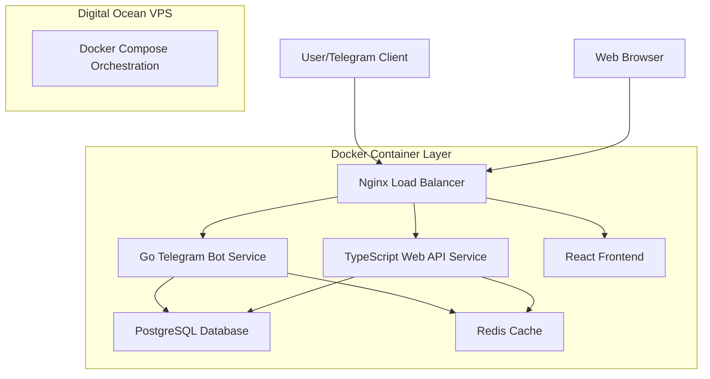
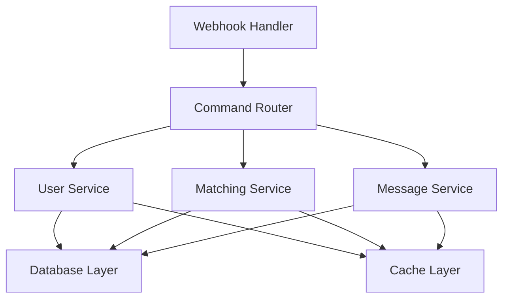
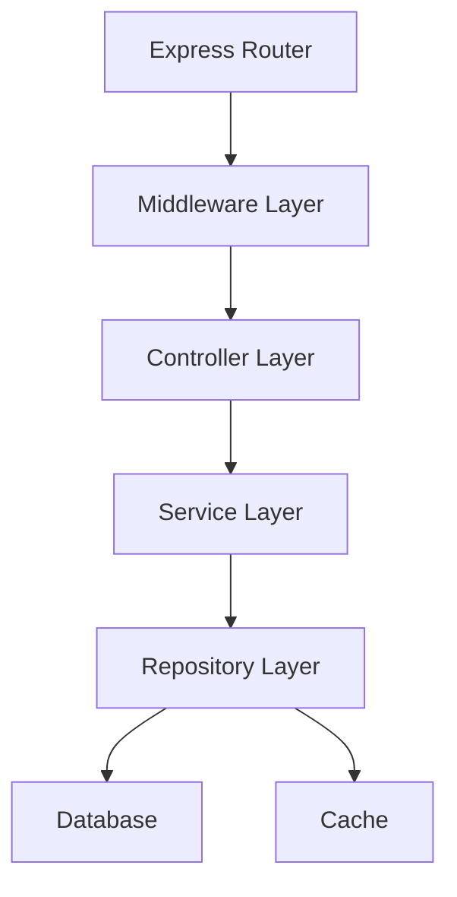

# Technical Documentation for MeetsMatch Telegram Bot

This document outlines the core technologies, architecture, libraries, and tools used in the development of this Telegram bot, built with Go and TypeScript and deployed using Docker on DigitalOcean VPS.

## Architecture Overview

The application operates as a multi-service architecture with the following components:

- **Go Telegram Bot Service**: Handles Telegram webhook requests and bot interactions
- **TypeScript Web API Service**: Provides REST API endpoints for web interface
- **React Frontend**: Web-based user interface
- **PostgreSQL Database**: Primary data storage
- **Redis Cache**: Session management and caching
- **Nginx**: Reverse proxy and load balancer
- **Docker**: Containerization and orchestration

### System Architecture


### Request Flow
1. **Telegram Requests**: Incoming Telegram webhook requests are processed by the Go bot service
2. **Web Requests**: Web interface requests are handled by the TypeScript API service
3. **Load Balancing**: Nginx distributes requests and serves static frontend assets
4. **Data Layer**: Both services interact with PostgreSQL for persistence and Redis for caching
5. **Session Management**: User sessions and temporary data stored in Redis

## Core Technologies

### Backend Services
- **Go (1.21+)**: Primary language for Telegram bot service
  - High performance and concurrency
  - Excellent for webhook handling and real-time processing
  - Strong typing and memory safety
- **TypeScript (5+) with Node.js (20+)**: Web API service
  - Type-safe JavaScript for web APIs
  - Rich ecosystem for web development
  - Easy integration with frontend

### Frontend
- **React (18+)**: Modern UI framework
- **TypeScript (5+)**: Type-safe frontend development
- **Vite (5+)**: Fast build tool and development server
- **Bun**: Package manager and runtime (replacing npm/pnpm)

### Data Layer
- **PostgreSQL (18+)**: Primary relational database
  - ACID compliance and strong consistency
  - Advanced features like JSONB and full-text search
  - Excellent performance for complex queries
- **Redis (7+)**: In-memory cache and session store
  - High-performance caching
  - Session management
  - Real-time features support

### Infrastructure
- **Docker (24+)**: Containerization platform
- **Docker Compose (2.20+)**: Multi-container orchestration
- **Nginx (1.25+)**: Reverse proxy and web server
- **DigitalOcean VPS**: Cloud hosting platform
- **Ubuntu 22.04 LTS**: Operating system

## Key Libraries and Tools

### Go Service Dependencies
- **github.com/gin-gonic/gin**: HTTP web framework
- **github.com/go-telegram/bot**: Telegram bot API client
- **github.com/lib/pq**: PostgreSQL driver
- **github.com/google/uuid**: UUID generation
- **github.com/redis/go-redis**: Redis client

### TypeScript Service Dependencies
- **express**: Web application framework
- **cors**: Cross-origin resource sharing
- **jsonwebtoken**: JWT token handling
- **pg**: PostgreSQL client
- **redis**: Redis client
- **bcrypt**: Password hashing

### Frontend Dependencies
- **react**: UI framework
- **react-router-dom**: Client-side routing
- **zustand**: State management
- **tailwindcss**: Utility-first CSS framework
- **axios**: HTTP client

### Development Tools
- **Bun**: Package manager and runtime
- **Oxlint**: Fast linting (replacing ESLint/Prettier)
- **Vitest**: Testing framework
- **TypeScript**: Type checking
- **Docker Compose**: Local development environment

## Development Environment

### Prerequisites
1. **Docker & Docker Compose**: For containerized development
2. **Go (1.21+)**: For Go service development
3. **Bun**: For TypeScript/React development
4. **Git**: Version control

### Local Setup
```bash
# Clone repository
git clone <repository-url>
cd meetsmatch

# Start development environment
docker-compose up -d

# Install frontend dependencies
cd web/frontend
bun install

# Install API dependencies
cd ../api
bun install

# Install Go dependencies
cd ../../services/bot
go mod download
```

### Development Workflow
- **Go Service**: Direct development with hot reload
- **TypeScript Services**: Bun for package management and development
- **Database**: PostgreSQL in Docker container
- **Cache**: Redis in Docker container
- **Frontend**: Vite development server with hot reload

## Service Architecture

### Go Telegram Bot Service


**Key Components:**
- **Handler Layer**: Processes incoming Telegram updates
- **Service Layer**: Business logic for users, matching, messaging
- **Repository Layer**: Data access abstraction
- **Middleware**: Authentication, rate limiting, logging

### TypeScript Web API Service


**Key Components:**
- **Router**: API endpoint definitions
- **Middleware**: CORS, authentication, validation
- **Controllers**: Request/response handling
- **Services**: Business logic implementation
- **Repositories**: Data access layer

## Data Management

### Database Schema
- **users**: User profiles and metadata
- **matches**: Match relationships and compatibility scores
- **conversations**: Chat conversations between users
- **messages**: Individual messages in conversations
- **user_preferences**: Matching preferences and filters
- **media_files**: User uploaded media references

### Caching Strategy
- **L1 Cache**: Application-level caching (in-memory)
- **L2 Cache**: Redis for shared cache across services
- **Session Storage**: Redis for user sessions and temporary data
- **Database**: PostgreSQL for persistent data

### Data Flow
1. **Read Path**: Check cache → Database if miss → Update cache
2. **Write Path**: Update database → Invalidate/update cache
3. **Session Management**: Redis for temporary session data
4. **Media Storage**: File system with database metadata

## Security & Privacy

### Authentication & Authorization
- **Telegram Authentication**: OAuth-like flow with Telegram
- **JWT Tokens**: Stateless authentication for web API
- **Role-Based Access Control**: User roles and permissions
- **Rate Limiting**: API and user action rate limits

### Data Protection
- **Input Validation**: Comprehensive sanitization
- **SQL Injection Prevention**: Parameterized queries
- **XSS Protection**: Content Security Policy
- **HTTPS**: TLS encryption for all communications
- **GDPR Compliance**: Data deletion and export capabilities

## Monitoring & Observability

### Health Checks
- Service health endpoints (`/health`)
- Database connectivity checks
- Cache availability monitoring
- Dependency health verification

### Logging
- Structured logging with JSON format
- Centralized log aggregation
- Error tracking and alerting
- Performance metrics collection

### Metrics
- Application performance metrics
- Business metrics (matches, conversations)
- Infrastructure metrics (CPU, memory, disk)
- Custom metrics for feature usage

## Deployment

### Container Strategy
- **Multi-stage builds**: Optimized container images
- **Health checks**: Container health monitoring
- **Resource limits**: CPU and memory constraints
- **Restart policies**: Automatic recovery from failures

### Environment Management
- **Development**: Local Docker Compose setup
- **Staging**: Production-like environment for testing
- **Production**: DigitalOcean VPS with Docker Compose

### CI/CD Pipeline
- **Build**: Docker image creation
- **Test**: Automated testing with coverage
- **Deploy**: Rolling deployment with health checks
- **Rollback**: Quick rollback capabilities

## Performance Considerations

### Optimization Strategies
- **Connection Pooling**: Database connection management
- **Caching**: Multi-layer caching strategy
- **Async Processing**: Non-blocking operations
- **Load Balancing**: Request distribution

### Scalability
- **Horizontal Scaling**: Multiple service instances
- **Database Optimization**: Indexing and query optimization
- **Cache Warming**: Proactive cache population
- **Resource Monitoring**: Capacity planning

## Testing Strategy

### Testing Framework
- **Go**: Built-in testing with testify
- **TypeScript**: Vitest for unit and integration tests
- **Frontend**: Vitest with React Testing Library
- **E2E**: Playwright for end-to-end testing

### Test Coverage
- **Unit Tests**: Individual function testing
- **Integration Tests**: Service interaction testing
- **API Tests**: Endpoint testing
- **Coverage Target**: >95% code coverage

### Quality Assurance
- **Linting**: Oxlint for code quality
- **Type Checking**: TypeScript and Go type safety
- **Code Review**: Pull request reviews
- **Automated Testing**: CI/CD pipeline integration

This document provides a comprehensive overview of the current technology stack. As the project evolves, specific libraries or tools might be added or changed. Always refer to `go.mod`, `package.json`, and `docker-compose.yml` for the definitive list of dependencies and configurations.
